# BillieBot — MBSE System Decomposition: Requirements, Activity Diagrams & Internal Block Diagrams

**Author role:** Senior Systems Engineer deliverable
**Purpose:** Complete decomposition of the BillieBot system into discrete, verifiable requirements, with MSOSA/Cameo-ready Activity Diagram (ACT) and Internal Block Diagram (IBD) specifications that make every requirement demonstrable, plus full traceability and an implementation-compliance assessment.
**Date:** 2026-07-04
**Sources:** `BillieBot_System_Design.md` (design baseline), static analysis of every package in `billiebot_ws/src/`, `firmware/README.md`, `reference_my_bot/diff-drive-motor-controller/`, `docs/VERIFICATION.md` (TC-01…TC-22), `docs/BRINGUP_LADDER_ANALYSIS.md`, `docs/MEASURE_ME.md`. No code was executed or modified to produce this report.

---

## 0. How to Read This Document

### 0.1 Baseline convention

This report models the **to-be (intended) system**: every requirement is a normative *shall* statement drawn from the design baseline and expanded to atomic, verifiable granularity. Because the implementation diverges from the design in known ways, **every Level-2 requirement carries an implementation-status assessment** with code evidence, so the document doubles as a gap-closure worklist:

| Status | Meaning |
|---|---|
| ✅ **Satisfied** | Mechanism fully implemented in the repository; verifiable today (in mock or on hardware). |
| 🟡 **Partial** | Mechanism exists but is incomplete, mis-parameterized, dormant, or only half of the requirement is met. |
| ❌ **Gap** | No implementing mechanism exists in the repository. |
| ⬜ **HW-pending** | Implementation complete as far as software can go; verification requires physical hardware (timing rig, real dog, battery test). |

Diagrams model the intended system; elements whose implementation is Partial/Gap are flagged **[GAP-n]** referencing the discrepancy register in §5.4.

### 0.2 Cameo/MSOSA transcription convention

Each diagram is given twice:

1. **Element specification tables** — one row per model element (block, part, port, connector, item flow, action, pin, control/object flow, accept-event action, partition), designed for 1:1 transcription into MSOSA/Cameo. Column headings use SysML metaclass names.
2. **Mermaid rendering** — a GitHub-renderable visual of the same diagram so the report is readable standalone. The element table, not the picture, is the authoritative specification.

Stereotypes (create in package `0 Profiles`, per design §3.1): `«rosNode»` (software component block), `«rosTopic»`, `«rosService»`, `«rosAction»` (connector/flow stereotypes), `«futureRelease»` (post-MVP elements, tag `release = "v2"`), `«mockable»` (component with a `mock:=true` hardware-free mode).

### 0.3 Requirement identifier scheme

| Level | Prefix | Count | Source |
|---|---|---|---|
| L0 Stakeholder | `STK-n` | 8 | Design §2.1, verbatim |
| L1 System | `SYS-<grp>-n` | 27 | Design §2.2, verbatim (rewording noted where applied) |
| L2 Subsystem/derived | `<GRP>-nn` | 97 (this report, **new**) | Decomposed from L1 against the as-built architecture |

L2 groups: **MOB** (mobility/base), **NAV** (navigation/localization), **PER** (perception), **AUD** (audio), **STL** (state estimation & logging), **RPT** (reporting), **MSN** (mission management), **IFC** (interface contracts), **PLT** (platform/deployment), **EXT** (extensibility).

Each L2 requirement row carries: shall statement · trace (`⟵` = deriveReqt to parent) · verification method (**I**nspection / **A**nalysis / **D**emonstration / **T**est) · the diagram element(s) and acceptance test (TC-nn) that demonstrate it · implementation status · code evidence (repo path + symbol/parameter).

### 0.4 Verification method key

- **I** — Inspection of design artifacts, code, or hardware.
- **A** — Analysis (budget rollup, timing analysis, statistics).
- **D** — Demonstration (qualitative run: "it navigates the apartment").
- **T** — Test (quantitative pass/fail against a threshold).

---

## 1. System Overview

### 1.1 Concept of operations (recap)

BillieBot is a differential-drive indoor robot that autonomously patrols an apartment, locates a miniature dachshund (Billie), observes her from a non-intrusive standoff distance (≥ 1.0 m), classifies her behavioral state from fused visual/thermal/audio evidence, logs state transitions to a persistent store, and serves a daily activity summary over HTTP. The MVP is **observe-and-report only**. The architecture reserves explicit extension points (uniform engagement action servers, a `PolicyDecision` hook, a logged `(context, action, outcome)` tuple stream, a `stress_proxy` field) so a future Behavior-AI (contextual bandit / RL-lite) can be inserted without interface changes.

Operational modes: `IDLE`, `PATROL`, `INVESTIGATE` (audio-cued), `TRACK_OBSERVE`, `RETURN`, `SAFE` (low battery / fault / e-stop).

### 1.2 Tri-processor architecture

| Execution environment | Block (§4.1) | Role | Software allocated |
|---|---|---|---|
| **Jetson Orin Nano** | `jet` | Real-time autonomy; keeps the perception→planning loop off Wi-Fi | `rplidar_node`, `base_bridge`, `ekf_filter_node`, `slam_toolbox`/`amcl`+`map_server`, Nav2 servers, `oakd_dog_detector`, `dog_locator`, `mission_controller`, engagement action servers |
| **Raspberry Pi 4/5** | `pi` | Sensing & cognition companion; isolates bursty audio/thermal/logging work | `thermal_node`, `noir_cam_node`, `audio_classifier`, `speaker_node`, `state_fusion`, `dog_logger`, `daily_report`, `report_server` |
| **Arduino Nano V3** | `mcu` | Hard real-time I/O | Encoder ISRs, 30 Hz PID, L298N PWM/DIR, battery ADC, serial protocol, AUTO_STOP watchdog |

Inter-host transport: ROS 2 over CycloneDDS, multicast disabled, static unicast peers (`billiebot_bringup/config/cyclonedds.xml`); Jetson↔Arduino over 57600-baud USB serial; operator access via Wi-Fi router (DDS to Foxglove/RViz, HTTP :8080 for reports).

### 1.3 Model organization (Cameo containment tree)

Extends design §3.1 with the new diagrams introduced by this report (marked ★):

```
BillieBot SoS Model
├── 0 Profiles            («futureRelease», «rosNode», «rosTopic», «rosService», «rosAction», «mockable»)
├── 1 Requirements
│   ├── REQ-01 Stakeholder Requirements        (STK-1…8)
│   ├── REQ-02 System Requirements Trace       (SYS-*)
│   └── REQ-03 Subsystem Requirements Trace ★  (MOB/NAV/PER/AUD/STL/RPT/MSN/IFC/PLT/EXT, §2.3)
├── 2 Use Cases            (Patrol, Find Dog, Log State, Daily Report, Teleoperate,
│                           E-Stop, [«futureRelease»] Engage Dog, Learn Policy)
├── 3 Structure
│   ├── 3.1 SoS Context           (BDD-00, IBD-00)
│   ├── 3.2 Robot Segment         (BDD-01…BDD-06, IBD-01, IBD-02, IBD-03, IBD-04 ★)
│   └── 3.3 Support Segment       (router, host computer, charger)
├── 4 Behavior              (STM-01; ACT-01…ACT-04; ACT-05…ACT-08 ★)
├── 5 Interfaces            (interface blocks §3.2, signals §3.3, item flows §3.4, ROS message defs)
└── 6 Analysis              (satisfy matrix §5.1, verify matrix §5.2, SW→HW allocation §5.3,
                             compliance/discrepancy register §5.4, power rollup)
```

---

## 2. Requirements Architecture

### 2.1 Level 0 — Stakeholder requirements (REQ-01)

Carried verbatim from design §2.1. Model as `«requirement»` elements; STK-7/8 additionally `«futureRelease»`.

| ID | Shall statement | Source |
|---|---|---|
| **STK-1** | BillieBot shall autonomously navigate the apartment without getting stuck. | User req (i) |
| **STK-2** | BillieBot shall autonomously find Billie. | User req (ii) |
| **STK-3** | BillieBot shall visually detect Billie using a visible-light and/or IR camera. | User req (iii) |
| **STK-4** | BillieBot shall auditorily detect when Billie barks or makes other loud noises. | User req (iv) |
| **STK-5** | BillieBot shall classify and log Billie's state (e.g., sleeping, active, barking). | User req (v) |
| **STK-6** | BillieBot shall generate a daily summary of Billie's activities. | User req (vi) |
| **STK-7** *(post-MVP)* | BillieBot shall decide when/if to engage Billie (approach, retreat, speak, dispense treat). | User future req |
| **STK-8** *(post-MVP)* | BillieBot shall learn which actions increase engagement without causing stress. | User future req |

### 2.2 Level 1 — System requirements (REQ-02)

Carried from design §2.2 (27 requirements in 7 groups). Kept verbatim except where flagged **[reworded]** to restore testability. Status here is a *rollup* of the L2 children in §2.3 (a Partial/Gap child caps the parent at Partial).

**SYS-NAV — Navigation ⟵ STK-1, STK-2**

| ID | Requirement | V | Rollup status |
|---|---|---|---|
| SYS-NAV-1 | Build and persist a 2-D occupancy map of the apartment using onboard lidar SLAM. | D | ✅ (⬜ HW demo pending) |
| SYS-NAV-2 | Localize within the saved map with ≤ 0.15 m mean position error. | T | ⬜ HW-pending |
| SYS-NAV-3 | Plan and execute collision-free paths between reachable waypoints, replanning around dynamic obstacles (incl. the dog). | D | ✅ (⬜ HW demo pending) |
| SYS-NAV-4 | Detect a stuck condition (commanded motion, no odometric progress > 5 s) and execute recovery behaviors; after 3 failed recoveries enter SAFE and alert operator. | T | 🟡 (escalation is a Gap) |
| SYS-NAV-5 | Limit speed to ≤ 0.3 m/s in normal transit and ≤ 0.15 m/s within 2 m of a detected dog. | T | 🟡 (near-dog limit is a Gap) |
| SYS-NAV-6 | Execute a configurable patrol route over user-defined waypoints covering all rooms. | D | ❌ (no node dispatches waypoints) |

**SYS-FND — Search/Find ⟵ STK-2**

| ID | Requirement | V | Rollup status |
|---|---|---|---|
| SYS-FND-1 | Search patrol waypoints in priority order (last-known location first, then likelihood-weighted) until the dog is detected or all waypoints exhausted. | D | ❌ |
| SYS-FND-2 | Upon an audio event with DoA, re-prioritize search toward the DoA bearing. | D | ❌ (log-only stub) |
| SYS-FND-3 | Upon visual detection, approach to and hold a standoff distance of 1.0–2.0 m (never closer than 1.0 m in MVP). | T | ✅ (approach); 🟡 (hold) |
| SYS-FND-4 | Find the dog within 10 minutes in ≥ 80 % of trials when the dog is in a mapped room. | T | ⬜ HW-pending (blocked by SYS-FND-1) |

**SYS-PER — Perception ⟵ STK-3, STK-4**

| ID | Requirement | V | Rollup status |
|---|---|---|---|
| SYS-PER-1 | Detect a dog in RGB imagery at ≥ 5 FPS with ≥ 85 % recall at ≤ 4 m (COCO class `dog`). | T | 🟡 (model blob not configured) |
| SYS-PER-2 | Estimate the 3-D position of a detected dog in the map frame using stereo depth (±0.2 m at 2 m). | T | ✅ (⬜ accuracy test pending) |
| SYS-PER-3 | Detect a warm body (30–40 °C blob ≥ N pixels) with the thermal camera in darkness at ≤ 1.5 m. | T | ✅ (⬜ range test pending) |
| SYS-PER-4 | Detect bark/whine/howl/loud-noise audio events (≥ 80 % recall on a recorded test set) and report DoA (±15°). | T | ✅ (⬜ recall test pending) |
| SYS-PER-5 | Low-light detect the dog via the NoIR camera when ambient lux < threshold (requires IR illuminator). | D | 🟡 (image published; no consumer, no illuminator) |

**SYS-STL — State Estimation & Logging ⟵ STK-5**

| ID | Requirement | V | Rollup status |
|---|---|---|---|
| SYS-STL-1 | Fuse visual, thermal, and audio evidence into a dog-state estimate from {SLEEPING, RESTING, ACTIVE, BARKING, EATING*, NOT-FOUND} with confidence. | T | ✅ (EATING optional, unproduced) |
| SYS-STL-2 | Log every state transition and detection event to a persistent store with timestamp, state, confidence, map location, and image snapshot reference. | T | 🟡 (snapshot is placeholder) |
| SYS-STL-3 | The state message schema shall be forward-compatible with the Behavior AI (reserved feature-vector fields). | I | ✅ |
| SYS-STL-4 | Logging shall survive power loss without database corruption (WAL mode; snapshot fsync). | T | ✅ (⬜ pull-plug test pending) |

**SYS-RPT — Reporting ⟵ STK-6**

| ID | Requirement | V | Rollup status |
|---|---|---|---|
| SYS-RPT-1 | Generate, once per day at a configured time, a summary: total sleep/rest/active durations, bark count and times, activity timeline, rooms visited, representative snapshots. | D | 🟡 (snapshots empty) |
| SYS-RPT-2 | The summary shall be retrievable from the host computer via the local network (HTTP page or file share). | D | ✅ |

**SYS-PLT — Platform/Support**

| ID | Requirement | V | Rollup status |
|---|---|---|---|
| SYS-PLT-1 | Endurance ≥ 60 min continuous patrol per battery charge. | T | ⬜ HW-pending (analysis in design §4.2) |
| SYS-PLT-2 | Monitor battery voltage and enter SAFE mode (stop, alert, request pickup) at ≤ 3.5 V/cell; hard cutoff documented at 3.3 V/cell. | T | 🟡 (no alert/pickup) |
| SYS-PLT-3 | All power branches individually fused; motor and compute rails electrically separated at the distribution bus. | I | ⬜ HW inspection |
| SYS-PLT-4 | Operator can teleoperate, visualize, configure waypoints, and e-stop from the host over Wi-Fi. | D | 🟡 (surface exists; waypoint config not wired) |
| SYS-PLT-5 | Software e-stop cuts motor PWM within 200 ms; loss of Jetson↔Arduino heartbeat > 500 ms stops motors autonomously. | T | 🟡 (firmware constant not applied in reference source) |
| SYS-PLT-6 | No sudden loud sounds; speaker output reserved and rate-limited. | I | ✅ |

**SYS-EXT — Extensibility ⟵ STK-7, STK-8**

| ID | Requirement | V | Rollup status |
|---|---|---|---|
| SYS-EXT-1 | Engagement primitives (ApproachDog, Retreat, Speak, DispenseTreat-stub) implemented as ROS 2 action servers with a uniform interface. | I | ✅ |
| SYS-EXT-2 | Mission logic shall be a behavior tree with a designated `PolicyDecision` extension point; MVP plugs in a static `ObserveOnlyPolicy`. | I | 🟡 (BT assets exist but are not executed) |
| SYS-EXT-3 | The event log shall record (context, action, outcome) tuples for all robot actions near the dog. | I | 🟡 (action hard-coded OBSERVE; results not captured) |
| SYS-EXT-4 | The dog-state message shall include a `stress_proxy` field (MVP heuristic). | I | ✅ |
| SYS-EXT-5 | Power distribution reserve (5 V ≥ 2 A rail headroom) for a treat-dispenser actuator. | I | ⬜ HW inspection |

### 2.3 Level 2 — Subsystem requirements (REQ-03, new in this report)

These 97 requirements decompose the L1 set to atomic, individually verifiable statements whose values are grounded in the repository (parameter names cited). **Every row names the diagram element(s) and acceptance test that demonstrate it** — this is the property the sponsor asked for: verifiability directly from the ACT/IBD set.

Column key: **Trace** = deriveReqt parent · **V** = verification method · **Demonstrated by** = diagram / test evidence · **Status** per §0.1 · **Evidence** = implementing artifact.

#### 2.3.1 MOB — Mobility & base control

| ID | Requirement (shall) | Trace ⟵ | V | Demonstrated by | Status | Evidence |
|---|---|---|---|---|---|---|
| MOB-01 | The base subsystem shall accept body velocity commands as `geometry_msgs/Twist` on `/cmd_vel` and convert them to left/right wheel angular-velocity targets by differential-drive inverse kinematics using `wheel_radius` = 0.034 m and `wheel_separation` = 0.298 m. | SYS-NAV-3 | T | ACT-06 a3; IBD-03 c1; TC-03 | ✅ | `billiebot_base/base_bridge.py` (`cmd_vel_callback`); `config/base_driver.yaml` |
| MOB-02 | The base subsystem shall transmit wheel targets to the motor controller as encoder counts-per-PID-loop via serial command `m <L> <R>` at the 30 Hz control rate over a 57600-baud, CR-terminated UART link. | SYS-NAV-3, SYS-PLT-5 | T | ACT-06 a4; IBD-01 c5; IF_UART_Serial | ✅ | `base_bridge.py` (`update()`, `counts_per_loop`); `baudrate: 57600` |
| MOB-03 | The motor controller shall execute closed-loop PID wheel-velocity control at 30 Hz (`PID_RATE`) on quadrature-encoder feedback, with anti-windup and derivative-kick protection (gains Kp 20 / Kd 12 / Ki 0 / Ko 50 at delivery). | SYS-NAV-3 | T | ACT-06 a5–a7; IBD-01 blk mcu | ✅ | `reference_my_bot/.../diff_controller.h`, `ROSArduinoBridge.ino` |
| MOB-04 | The base subsystem shall command zero wheel velocity if no `/cmd_vel` message is received within 0.5 s (`cmd_timeout_sec`) — the software deadman. | SYS-PLT-5 | T | ACT-05 a4; TC-06 | ✅ | `base_bridge.py` (`update()` timeout gate) |
| MOB-05 | The motor controller shall autonomously stop both motors within 500 ms of the last received motor command (`AUTO_STOP_INTERVAL` = 500 ms), independent of the Jetson. | SYS-PLT-5 | T | ACT-05 a6–a7 **[GAP-14]** | 🟡 | `firmware/README.md` documents the change; `reference .ino` still ships 2000 ms |
| MOB-06 | The base subsystem shall serve a software e-stop (`/e_stop`, `EStop.srv`) that on engage immediately zeroes wheel targets, transmits `m 0 0`, and inhibits all subsequent `/cmd_vel` until released. | SYS-PLT-5 | T | ACT-05 a1–a3; TC-06 | ✅ | `base_bridge.py` (`estop_callback`) |
| MOB-07 | The software e-stop path (service receipt → motor-stop frame on the UART) shall complete within 200 ms. | SYS-PLT-5 | A,T | ACT-05 timing note; TC-06 | ⬜ | 33 ms loop + serial latency ⇒ met by analysis; timing-rig test pending |
| MOB-08 | The base subsystem shall read cumulative encoder ticks via serial `e` each control cycle and integrate planar dead-reckoned odometry with the midpoint-arc model. | SYS-NAV-2 | T | ACT-06 a8–a9; TC-03 | ✅ | `base_bridge.py` (odometry integration) |
| MOB-09 | The base subsystem shall publish `nav_msgs/Odometry` on `/odom` and `sensor_msgs/JointState` on `/joint_states` at 30 Hz (`publish_rate_hz`). | SYS-NAV-2 | T | ACT-06 a10; IBD-03 c2/c3; TC-03, TC-04 | ✅ | `base_bridge.py` |
| MOB-10 | Motor and encoder electrical polarity shall be correctable in configuration without firmware changes (`left/right_motor_sign`, `left/right_encoder_sign` ∈ {+1, −1}). | SYS-NAV-3 | I | IBD-01 note; MEASURE_ME procedure | ✅ | `config/base_driver.yaml` |
| MOB-11 | The base subsystem shall reset encoder counters (serial `r`) at initialization when `reset_encoders_on_start` is true. | SYS-NAV-2 | T | ACT-06 a1 | ✅ | `base_bridge.py` (startup) |
| MOB-12 | The base subsystem shall sample battery pack voltage via the motor controller ADC (serial `a <pin>`, divider ratio 6.0, V = adc·5.0/1023·ratio) at 1 Hz and publish `sensor_msgs/BatteryState` including per-cell voltages and a health enum mapped at 10.5 V (LOW) / 9.9 V (CRITICAL). | SYS-PLT-2 | T | ACT-05 a8; IBD-03 c4; TC-05 | ✅ | `base_bridge.py` (`read_battery`) |
| MOB-13 | The base subsystem shall provide a hardware-free mock mode (`mock:=true`) substituting a simulated serial device that integrates commanded counts into synthetic encoder ticks and answers ADC reads. | SYS-PLT-4 (testability) | D | «mockable»; TC-01…TC-06 in mock | ✅ | `base_bridge.py` (`MockSerial`) |

#### 2.3.2 NAV — Navigation, localization & recovery

| ID | Requirement (shall) | Trace ⟵ | V | Demonstrated by | Status | Evidence |
|---|---|---|---|---|---|---|
| NAV-01 | The navigation subsystem shall build a 2-D occupancy grid at 0.05 m resolution from `/scan` using online asynchronous SLAM with loop closure (Ceres pose-graph backend, 12 m max laser range). | SYS-NAV-1 | D | ACT-08 a5; IBD-03 blk slam | ✅ | `billiebot_navigation/config/slam_toolbox_params.yaml` |
| NAV-02 | The navigation subsystem shall persist the map to disk (YAML+PGM) and reload it via `map_server` for localization runs. | SYS-NAV-1 | D | ACT-08 a6; IBD-03 blk map_server | ✅ | `slam_toolbox` save services; `localization.launch.py` |
| NAV-03 | The lidar driver shall publish `sensor_msgs/LaserScan` on `/scan` in frame `laser_frame` (RPLidar A1, 115200 baud, angle-compensated). | SYS-NAV-1/2/3 | T | IBD-01 c1; IBD-03 c5; ACT-08 a2 | ✅ | `01_lidar.launch.py` (real branch) |
| NAV-04 | A mock scan source shall exist so rungs 01/04/05/06 are exercisable without hardware. | SYS-PLT-4 (testability) | D | ACT-08 **[GAP-16]** | ❌ | mock branch launches a `base_bridge` stub with no `/scan` publisher |
| NAV-05 | The localization subsystem shall estimate map-frame pose with AMCL (500–2000 particles, likelihood-field model, differential motion model) and broadcast the `map→odom` transform; mean position error ≤ 0.15 m against surveyed ground truth. | SYS-NAV-2 | T | ACT-08 a7–a9; IBD-04 | ⬜ | `config/amcl_params.yaml`; quantitative test pending HW |
| NAV-06 | The state-estimation subsystem shall fuse wheel odometry (and IMU when enabled) in a 30 Hz planar EKF publishing `/odometry/filtered`. | SYS-NAV-2 | T | ACT-06 a11; IBD-03 blk ekf **[GAP-2]** | 🟡 | `config/ekf.yaml`; `imu0` block commented out pending A4/A5 rewire |
| NAV-07 | Exactly one component shall broadcast the `odom→base_link` transform at any time. | SYS-NAV-2 (derived, new) | T | IBD-04 note **[GAP-5, GAP-6]** | ❌ | `base_bridge` (`publish_tf: true`) **and** `ekf_filter_node` (`publish_tf: true`) both broadcast; EKF additionally launched twice by rung 06 |
| NAV-08 | Nav2 consumers shall use the filtered odometry (`/odometry/filtered`), not raw `/odom`. | SYS-NAV-2 (derived, new) | I | IBD-03 c6 **[GAP-4]** | ❌ | `nav2_params.yaml` `bt_navigator.odom_topic: /odom` |
| NAV-09 | The navigation subsystem shall plan global collision-free paths (NavFn, 0.5 m tolerance) and execute them with a 20 Hz local controller (DWB) using layered costmaps (static + obstacle + inflation) fed by `/scan`. | SYS-NAV-3 | D | ACT-01 a6; IBD-03 blk nav2; TC-16 | ✅ | `config/nav2_params.yaml` |
| NAV-10 | The local costmap shall mark and clear dynamic obstacles from `/scan` within 2.5 m so paths replan around moving obstacles including the dog. | SYS-NAV-3 | D | ACT-01 a6 note; TC-16 | ✅ | `nav2_params.yaml` obstacle layer |
| NAV-11 | Commanded speed shall never exceed 0.3 m/s in normal transit (`max_vel_x`, `max_speed_xy`). | SYS-NAV-5 | T | ACT-06 constraint; TC-18 | ✅ | `nav2_params.yaml` DWB limits |
| NAV-12 | Commanded speed shall not exceed 0.15 m/s while within 2.0 m of a detected dog, enforced by a costmap speed-filter/keepout mask fed from `/dog/pose_map`. | SYS-NAV-5 | T | ACT-07 a6 **[GAP-13]**; TC-18 | ❌ | No speed-filter layer exists; only `approach_dog_server` caps its own goals at 0.15 m/s |
| NAV-13 | The navigation subsystem shall declare a stuck condition when commanded motion produces < 0.5 m progress in 10 s (progress checker) — **note: L1 text says "> 5 s"; parameter alignment required** — and invoke recovery behaviors `spin`, `backup`, `wait`. | SYS-NAV-4 | T | ACT-04 a1–a5; TC-19 | 🟡 | `nav2_params.yaml` progress_checker + behavior_server; 10 s vs 5 s mismatch |
| NAV-14 | After 3 consecutive failed recovery attempts the mission layer shall transition to SAFE and raise an operator alert. | SYS-NAV-4 | T | ACT-04 a6–a8 **[GAP-7]**; TC-19 | ❌ | `mission_controller.py` `_nav_failure_count` is never incremented; no alert channel exists |
| NAV-15 | The robot model (URDF) shall define the kinematic and sensor frame tree with wheel geometry matching the drive configuration (radius 0.034 m, separation 0.298 m). | SYS-NAV-2 | I | IBD-04; TC-02 | ✅ | `billiebot_description/urdf/*.xacro` consistent with `base_driver.yaml` |

#### 2.3.3 PER — Perception

| ID | Requirement (shall) | Trace ⟵ | V | Demonstrated by | Status | Evidence |
|---|---|---|---|---|---|---|
| PER-01 | The RGB detector shall run YOLOv8n spatial detection on-device (OAK-D RVC2), retaining only COCO class 16 (`dog`) above `confidence_threshold` 0.5, at ≥ 5 Hz (`publish_rate_hz`). | SYS-PER-1 | T | ACT-01 a7; IBD-03 blk oakd; TC-07 | 🟡 | `oakd_dog_detector.py`; **[GAP-11]** `model_path` default `''` ⇒ real mode inert until configured |
| PER-02 | Each detection shall be published as `DogDetection3D` on `/dog/detections_3d` carrying bbox, confidence, camera-frame 3-D position (stereo, 0.1–5 m depth window), and depth. | SYS-PER-2 | T | IBD-03 c7; IFC-01; TC-07 | ✅ | `oakd_dog_detector.py` (spatial coords mm→m) |
| PER-03 | The dog locator shall transform detections with confidence ≥ 0.5 from the camera optical frame to the `map` frame via TF (0.1 s timeout) and publish `geometry_msgs/PoseStamped` on `/dog/pose_map`. | SYS-PER-2 | T | ACT-02 a2; IBD-03 c8; TC-08 | ✅ | `dog_locator.py` |
| PER-04 | Exactly one component shall publish the dog-found flag `/dog/found` (`std_msgs/Bool`). | SYS-PER-2 (derived, new) | I | IBD-03 note **[GAP-12]** | ❌ | Both `oakd_dog_detector` and `dog_locator` publish it |
| PER-05 | The thermal node shall acquire 32×24 MLX90640 frames over I²C at 4 Hz, publish them as `sensor_msgs/Image` (`32FC1`) on `/thermal/image`, and detect warm blobs with pixels in [30, 40] °C and area ≥ 8 px, publishing `ThermalBlob` on `/thermal/blob`. | SYS-PER-3 | T | ACT-02 a3; IBD-03 c9/c10; TC-09, TC-10 | ✅ | `thermal_node.py` (`dog_temp_min/max`, `min_blob_area`) |
| PER-06 | The NoIR camera node shall publish 640×480 `rgb8` frames at 5 Hz on `/noir/image` for low-light operation; a downstream low-light detection consumer and an 850 nm IR illuminator are required to close SYS-PER-5. | SYS-PER-5 | D | IBD-03 c11 **[GAP: no consumer]** | 🟡 | `noir_cam_node.py`; no subscriber in workspace; illuminator on HW gap list |
| PER-07 | All perception outputs shall be stamped in the correct URDF optical frame (`oakd_link_optical`, `thermal_link_optical`, `noir_link_optical`) so TF products are valid. | SYS-PER-2 | I | IBD-04 | ✅ | node `camera_frame`/`thermal_frame` params match xacro link names |
| PER-08 | Every perception node shall provide a mock mode emitting statistically plausible synthetic detections (dog ≈ 70 % of ticks; warm blob at frame center) for hardware-free verification. | SYS-PLT-4 (testability) | D | «mockable»; TC-07…TC-10 in mock | ✅ | `mock_detect` paths in all three perception nodes |

#### 2.3.4 AUD — Audio

| ID | Requirement (shall) | Trace ⟵ | V | Demonstrated by | Status | Evidence |
|---|---|---|---|---|---|---|
| AUD-01 | The audio classifier shall capture 0.975 s mono chunks at 16 kHz, gate on RMS energy ≥ −30 dB, classify with YAMNet (TFLite), and map classes to {BARK, WHINE, HOWL, LOUD_NOISE} (Bark/Bow-wow/Yip/Growling→BARK; Howl→HOWL; Whimper→WHINE; other→LOUD_NOISE). | SYS-PER-4 | T | ACT-02 a4; IBD-03 blk audio; TC-11 | ✅ | `audio_classifier.py` (`YAMNET_DOG_CLASSES`) |
| AUD-02 | Each audio event shall be published as `AudioEvent` on `/audio/events` (≤ 2 Hz) with event type, confidence, `doa_deg` ∈ [0, 360), YAMNet label, and energy in dB. | SYS-PER-4 | T | IBD-03 c12; IFC-03; TC-11 | ✅ | `audio_classifier.py` |
| AUD-03 | Direction of arrival shall be read from the ReSpeaker XVF3800 via USB control transfer and reported per event with ±15° accuracy. | SYS-PER-4 | T | ACT-01 accept-event; TC-11 | ⬜ | DoA read implemented (vendor 0x2886); accuracy test pending HW |
| AUD-04 | Bark-class recall shall be ≥ 80 % on the recorded Billie test set at the configured `confidence_threshold` (0.3). | SYS-PER-4 | T | TC-11 (dataset run) | ⬜ | threshold in `config/audio.yaml`; labeled dataset pending |
| AUD-05 | Speaker output shall be rate-limited (reject goals < 10 s since last playback, `min_interval_sec`) and volume-capped (0.5, `max_volume`), enforced in the action server *below* any future policy. | SYS-PLT-6, SYS-EXT-1 | T | ACT-07 rail note; IBD-03 blk speaker | ✅ | `speaker_node.py` (`goal_callback` rejection) |
| AUD-06 | The Speak primitive shall be exposed as a ROS 2 action (`Speak.action`) with a single canonical action name reachable by the mission layer. | SYS-EXT-1 | I | IBD-03 c13 **[GAP-17]** | 🟡 | `speaker_node` serves `/speak`; mission wrapper serves `/mission/speak`; BT XML `Speak` binds to neither |

#### 2.3.5 STL — State estimation & logging

| ID | Requirement (shall) | Trace ⟵ | V | Demonstrated by | Status | Evidence |
|---|---|---|---|---|---|---|
| STL-01 | The fusion component shall maintain timestamped evidence windows (visual, thermal, audio, pose) pruned to a 10 s sliding horizon (`window_sec`), evaluated at 2 Hz. | SYS-STL-1 | T | ACT-02 a5; TC-12 | ✅ | `state_fusion.py` (deques + prune) |
| STL-02 | The fusion component shall classify BARKING when ≥ 2 bark events lie in the window. | SYS-STL-1 | T | ACT-02 d1; TC-12 | ✅ | `state_fusion.py` decision ladder |
| STL-03 | With visual evidence present, the fusion component shall classify SLEEPING (mean thermal < 33 °C ∧ no audio), RESTING (< 36 °C ∧ no audio), else ACTIVE; visual-only ⇒ ACTIVE; thermal-only ⇒ RESTING; no evidence ⇒ NOT_FOUND. | SYS-STL-1 | T | ACT-02 d2–d4; TC-12 | ✅ | `state_fusion.py` |
| STL-04 | A candidate state shall persist ≥ 3 s (`hysteresis_sec`) before the published state commits (chatter suppression). | SYS-STL-1 | T | ACT-02 a6; TC-12 | ✅ | `state_fusion.py` |
| STL-05 | The fused estimate shall be published as `DogState` on `/billie/state` at 2 Hz with state, confidence, map position, room, `context[]`, `stress_proxy`, and `state_duration`. | SYS-STL-1/3 | T | IBD-03 c14; IFC-02; TC-12 | ✅ | `state_fusion.py` |
| STL-06 | `stress_proxy` shall be computed as min(1, bark_rate / 0.3) (`bark_rate_stress_threshold`). | SYS-EXT-4 | T | ACT-02 a7 | ✅ | `state_fusion.py` |
| STL-07 | `context[]` shall carry the 6-element bandit feature vector [n_visual, n_thermal, n_barks, n_whines, bark_rate, stress_proxy]. | SYS-STL-3, SYS-EXT-3 | I | IFC-02 | ✅ | `state_fusion.py` |
| STL-08 | The last fused state shall be queryable on demand via `/get_dog_state` (`GetDogState.srv`). | SYS-STL-1 | T | IBD-03 c15; TC-14 | ✅ | `state_fusion.py` service |
| STL-09 | The logger shall persist every state transition, and a heartbeat record at least every 60 s, to SQLite in WAL mode with (timestamp, epoch, state, state_id, confidence, x, y, room, image_path, context_json, action, outcome, stress_proxy). | SYS-STL-2/4 | T | ACT-02 a8–a9; TC-20 | ✅ | `dog_logger.py` (`db_path` `/var/lib/billiebot/billie_events.db`) |
| STL-10 | The database shall remain uncorrupted across power loss (WAL journaling; snapshot fsync). | SYS-STL-4 | T | TC-20 + pull-plug procedure | ⬜ | WAL enabled; destructive test pending HW |
| STL-11 | Detection map positions shall be attributed to a named room via configured map-frame rectangular bounds, with non-overlapping room polygons after mapping. | SYS-STL-2 | T | ACT-02 a8; rooms.yaml | 🟡 | `config/rooms.yaml` — placeholder rects overlap; first-match-wins ambiguity |
| STL-12 | On each state transition the logger shall capture and fsync a real camera snapshot and store its path in the event record. | SYS-STL-2, SYS-RPT-1 | T | ACT-02 a9 **[GAP-9]** | ❌ | `dog_logger.py` writes an empty placeholder `.jpg` |
| STL-13 | The logger shall record `(context, action, outcome)` for every engagement action executed near the dog, sourcing `action`/`outcome` from the action servers' results. | SYS-EXT-3 | I | ACT-02 a10 **[GAP-9]** | 🟡 | `action` column fixed to `'OBSERVE'`; no subscription to action results |
| STL-14 | The most recent event shall be exposed on a `/events/last` query interface for operator tooling. | SYS-STL-2 (derived from design §5.2) | D | IBD-03 **[GAP-9]** | ❌ | not implemented |

#### 2.3.6 RPT — Reporting

| ID | Requirement (shall) | Trace ⟵ | V | Demonstrated by | Status | Evidence |
|---|---|---|---|---|---|---|
| RPT-01 | The report generator shall produce, once per local day at the configured time (23:55, `generate_hour/minute`), a Markdown summary with per-state duration totals (gap-capped at 5 min), bark log with times, per-room visit counts, and an activity-timeline PNG. | SYS-RPT-1 | D | ACT-03 a1–a5; TC-21 | ✅ | `daily_report.py` (60 s scheduler tick; matplotlib Agg) |
| RPT-02 | Representative snapshots shall be embedded in the daily report. | SYS-RPT-1 | D | ACT-03 a4 **[GAP-9]** | ❌ | blocked by STL-12 (snapshots are empty files) |
| RPT-03 | Reports shall be retrievable over HTTP on port 8080 with routes `/` (rendered HTML), `/latest` (raw Markdown), `/reports` (index), `/health` (status JSON). | SYS-RPT-2 | T | ACT-03 a6–a7; IBD-00 c3; TC-22 | ✅ | `report_server.py` (FastAPI/uvicorn) |
| RPT-04 | The generator shall support on-demand (CLI `--standalone`) generation for any past day, for operator queries and testing. | SYS-RPT-1 (derived) | D | ACT-03 alt-flow | ✅ | `daily_report.py` `--standalone` |

#### 2.3.7 MSN — Mission management

| ID | Requirement (shall) | Trace ⟵ | V | Demonstrated by | Status | Evidence |
|---|---|---|---|---|---|---|
| MSN-01 | The mission subsystem shall implement the six operational modes {IDLE, PATROL, INVESTIGATE, TRACK_OBSERVE, RETURN, SAFE} with the transition set of STM-01. | SYS-EXT-2, STK-1/2 | D | STM-01; TC-13 | 🟡 | `mission_controller.py` `Mode` enum; INVESTIGATE/RETURN have no automatic transitions **[GAP-1]** |
| MSN-02 | The mission subsystem shall evaluate safety preconditions every tick (2 Hz) and force SAFE when e-stop is engaged, battery < 10.5 V, or navigation failures ≥ 3 — with all three inputs live. | SYS-PLT-2/5, SYS-NAV-4 | T | STM-01 guards; ACT-05 a9 **[GAP-7, GAP-8]** | 🟡 | battery check live; `_estopped` and `_nav_failure_count` are never set by any input |
| MSN-03 | The mission subsystem shall transition PATROL → TRACK_OBSERVE when `/dog/found` is true and back to PATROL when the dog is lost. | STK-2, SYS-FND-3 | D | STM-01 t3/t4; TC-13 | ✅ | `mission_controller.py` tick() |
| MSN-04 | Upon an `AudioEvent` with DoA received during PATROL, the mission subsystem shall enter INVESTIGATE and re-prioritize the waypoint queue toward the DoA bearing. | SYS-FND-2 | D | ACT-01 ae1 + a5 **[GAP-15]**; STM-01 t2 | ❌ | bark handler only logs; no queue re-sort, no INVESTIGATE entry |
| MSN-05 | While in PATROL the mission subsystem shall dispatch Nav2 `NavigateToPose` goals for successive patrol waypoints, seeded last-known-dog-location-first, and advance on goal result. | SYS-NAV-6, SYS-FND-1 | D | ACT-01 a4–a6 **[GAP-7]**; TC-16 | ❌ | action client constructed; no goal ever sent |
| MSN-06 | The patrol route shall be operator-configurable as named map-frame waypoints loaded from configuration (`patrol_waypoints.yaml`). | SYS-NAV-6, SYS-PLT-4 | I | ACT-01 a3 **[GAP-10]** | 🟡 | YAML exists but is loaded by no node; controller uses its own name list |
| MSN-07 | The mission subsystem shall publish `MissionStatus` on `/billiebot/mission_status` at 2 Hz (mode, waypoint, dog state/conf, battery, nav_active, recovery_count, estopped). | SYS-PLT-4 | T | IBD-03 c16; IFC-05; TC-13 | ✅ | `mission_controller.py` |
| MSN-08 | The operator shall be able to command a mode change via `/set_mode` (`SetMode.srv`), with invalid modes rejected and the previous mode returned. | SYS-PLT-4 | T | IBD-03 c17; TC-15 | ✅ | `mission_controller.py` service |
| MSN-09 | The ApproachDog action shall reject standoff goals < 1.0 m, cap speed at 0.15 m/s, compute the standoff pose from `/dog/pose_map`, and delegate motion to Nav2 `navigate_to_pose`. | SYS-FND-3, SYS-NAV-5 | T | ACT-07 a1–a7; TC-17 | ✅ | `approach_dog_server.py` (`min_standoff`, `max_speed`) |
| MSN-10 | The Retreat action shall move the robot rearward a commanded distance at 0.1 m/s (`retreat_speed`); closed-loop distance feedback is required for hazard-adjacent use. | SYS-EXT-1 | T | ACT-07 alt-flow | 🟡 | `retreat_server.py` — open-loop timed `/cmd_vel`, no odometry check |
| MSN-11 | The DispenseTreat action shall exist as a uniform-interface stub returning NOT_IMPLEMENTED until the actuator is fitted. | SYS-EXT-1/5 | I | IBD-03 blk actions | ✅ | `dispense_treat_server.py` |
| MSN-12 | Mission decision logic shall route through a `PolicyDecision` node (inputs: dog_state, stress_proxy; output: {OBSERVE, APPROACH, RETREAT, SPEAK, TREAT}) that in the MVP always returns OBSERVE (`ObserveOnlyPolicy`). | SYS-EXT-2 | I | ACT-01 a8; STM-01 «futureRelease» edge **[GAP-1]** | 🟡 | `policy_decision_node.cpp` exists, is compiled, but no executable ticks it; the Python controller has no policy hook |
| MSN-13 | All welfare/safety rails (standoff floor, speed caps, speaker rate limit, per-action cooldowns) shall be enforced inside the action servers, *below* the policy layer, so no future learned policy can violate them. | SYS-EXT-1, SYS-PLT-6 | I | ACT-07 rail notes | ✅ | `approach_dog_server.py`, `speaker_node.py` |
| MSN-14 | A `PatrolWaypoints` action server shall execute named-waypoint patrol sequences with per-waypoint feedback (the interface is already defined). | SYS-NAV-6 (derived) | D | IBD-03 **[GAP-10]**; TC-16 | ❌ | `PatrolWaypoints.action` defined; no server implements it |

#### 2.3.8 IFC — Interface contracts

| ID | Requirement (shall) | Trace ⟵ | V | Demonstrated by | Status | Evidence |
|---|---|---|---|---|---|---|
| IFC-01 | `DogDetection3D.msg` shall carry header, pixel bbox (x, y, w, h), confidence, camera-frame `geometry_msgs/Point` position, depth (m), and COCO label string. | SYS-PER-1/2 | I | IBD-03 item flows; TC-01 | ✅ | `billiebot_interfaces/msg/DogDetection3D.msg` |
| IFC-02 | `DogState.msg` shall enumerate states NOT_FOUND=0…EATING=5 and carry confidence, map position, room, variable-length `context[]`, `stress_proxy`, `state_duration` — forward-compatible with the Behavior AI without schema change. | SYS-STL-1/3, SYS-EXT-3/4 | I | IFC dictionary; TC-01 | ✅ | `msg/DogState.msg` |
| IFC-03 | `AudioEvent.msg` shall enumerate BARK=0…SILENCE=4 and carry confidence, `doa_deg`, `yamnet_label`, `energy_db`. | SYS-PER-4 | I | TC-01 | ✅ | `msg/AudioEvent.msg` |
| IFC-04 | `ThermalBlob.msg` shall carry blob centroid (image coords), pixel area, max/mean temperature (°C), and `is_dog_candidate`. | SYS-PER-3 | I | TC-01 | ✅ | `msg/ThermalBlob.msg` |
| IFC-05 | `MissionStatus.msg` shall enumerate modes IDLE=0…SAFE=5 and carry current waypoint, dog state + confidence, battery voltage, `nav_active`, `recovery_count`, `estopped`. | SYS-PLT-4 | I | TC-01, TC-13 | ✅ | `msg/MissionStatus.msg` |
| IFC-06 | Exactly one battery message contract shall be in service. The system uses `sensor_msgs/BatteryState`; the bespoke `BatteryStatus.msg` shall be either adopted or removed. | SYS-PLT-2 (hygiene) | I | IBD-03 note **[GAP-3]** | ❌ | `msg/BatteryStatus.msg` defined, published by nothing |
| IFC-07 | Services `EStop` (engage→success/message), `SetMode` (mode→success/message/previous_mode), `GetDogState` (→ DogState + dog_found) shall be provided at `/e_stop`, `/set_mode`, `/get_dog_state`. | SYS-PLT-4/5, SYS-STL-1 | T | IBD-03 c18; TC-06/14/15 | ✅ | `srv/*.srv`; serving nodes per IBD-03 |
| IFC-08 | The five engagement/patrol actions (`ApproachDog`, `Retreat`, `Speak`, `DispenseTreat`, `PatrolWaypoints`) shall share the uniform goal/result/feedback action pattern so a future policy can invoke any of them interchangeably. | SYS-EXT-1 | I | IBD-03 action connectors; TC-01 | ✅ (defs) / 🟡 (PatrolWaypoints unserved) | `action/*.action` |
| IFC-09 | All inter-node topic names and types shall match this report's IBD-03 connector table verbatim (the single source of truth for the ROS graph). | all | I | IBD-03 | ✅ | `run_all_mock_tests.sh` asserts the 15 core names |

#### 2.3.9 PLT — Platform & deployment

| ID | Requirement (shall) | Trace ⟵ | V | Demonstrated by | Status | Evidence |
|---|---|---|---|---|---|---|
| PLT-01 | Software shall deploy across hosts per the allocation matrix (§5.3): autonomy on the Jetson (`jetson.launch.py`), sensing/cognition on the Pi (`pi.launch.py`), real-time I/O on the Arduino. | design §4.1 | I | IBD-03 partitions; ACT-08 a1 | ✅ | `billiebot_bringup/launch/{jetson,pi}.launch.py` |
| PLT-02 | Inter-host DDS shall run CycloneDDS with multicast disabled and static unicast peers for the Jetson and Pi. | design §5.1 | T | IBD-00 c1; ACT-08 a1 | ✅ | `config/cyclonedds.xml` (IPs are placeholders per MEASURE_ME) |
| PLT-03 | Battery thresholds shall be 10.5 V (3.5 V/cell, LOW → SAFE entry) and 9.9 V (3.3 V/cell, CRITICAL / documented hard cutoff). | SYS-PLT-2 | T | ACT-05 d2; TC-05 | ✅ | `base_driver.yaml`, `mission.yaml` (`battery_safe_voltage`) |
| PLT-04 | On SAFE entry due to battery, the system shall stop motion, alert the operator, and request pickup. | SYS-PLT-2 | D | ACT-05 a10 **[GAP: alert unimplemented]** | 🟡 | mode transition exists; no alert/notification channel |
| PLT-05 | The operator teleop surface shall be `/cmd_vel` (Twist) plus `/e_stop`, reachable from the host over Wi-Fi/DDS. | SYS-PLT-4 | D | IBD-00 c2; TC-06 | ✅ | standard tools (`teleop_twist_keyboard`); no bespoke node needed |
| PLT-06 | Every bringup rung shall be runnable hardware-free (`mock:=true`) with mock fidelity sufficient to exercise the rung's verify criteria. | SYS-PLT-4 (testability) | D | ACT-08; verify scripts | 🟡 | rung 01 mock produces no `/scan` **[GAP-16]**; mock battery constant 12.58 V blocks SAFE-path testing |
| PLT-07 | Endurance shall be ≥ 60 min continuous patrol per charge (design power budget ≈ 33–40 W on a 44 Wh pack). | SYS-PLT-1 | A,T | design §4.2 rollup; soak test | ⬜ | analysis only; HW soak pending |
| PLT-08 | Power branches shall be individually fused with motor and compute rails separated at the distribution bus, per IBD-02. | SYS-PLT-3 | I | IBD-02 | ⬜ | HW inspection; modeled in §3.7 |
| PLT-09 | Each bringup rung shall have an automated verify script asserting its measurable outputs. | SYS-PLT-4 (testability) | T | verify_rung_*.sh | 🟡 | scripts exist for rungs 01/02/03/06/07/12 only |

#### 2.3.10 EXT — Extensibility (design-for, not build)

| ID | Requirement (shall) | Trace ⟵ | V | Demonstrated by | Status | Evidence |
|---|---|---|---|---|---|---|
| EXT-01 | Engagement primitives shall be invocable by any authorized client through their action interfaces without mission-code changes (the Behavior-AI insertion contract). | SYS-EXT-1 | I | IBD-03 action connectors | ✅ | four servers running under `mission.launch.py` |
| EXT-02 | The `PolicyDecision` extension point shall be the single seam where a learned policy replaces `ObserveOnlyPolicy`, selecting among {OBSERVE, APPROACH, RETREAT, SPEAK, TREAT}. | SYS-EXT-2 | I | ACT-01 a8; STM-01 «futureRelease» | 🟡 | seam exists in unexecuted C++ BT node **[GAP-1]** |
| EXT-03 | Historical `(context, action, outcome)` tuples logged under `ObserveOnlyPolicy` shall be sufficient to bootstrap the bandit's baseline distribution. | SYS-EXT-3 | A | ACT-02 a10; TC-20 | 🟡 | context logged; action/outcome capture incomplete (STL-13) |
| EXT-04 | `stress_proxy` shall be computed and logged with every state estimate so welfare regressions are measurable before and after policy insertion. | SYS-EXT-4 | T | ACT-02 a7; TC-12 | ✅ | `state_fusion.py`, `dog_logger.py` |
| EXT-05 | A fused 5 V ≥ 2 A power reserve (D24V90F5 rail) shall remain unallocated for the treat-dispenser actuator. | SYS-EXT-5 | I | IBD-02 p9 | ⬜ | HW inspection; modeled in §3.7 |

---

## 3. Structural Model — Blocks, Interfaces, Signals, IBDs

### 3.1 Block dictionary (package `3 Structure`)

**SoS tier (BDD-00):**

| Block | Kind | Notes |
|---|---|---|
| `BillieBot SoS` | system-of-systems | composes Robot + Support segments |
| `BillieBot Rover` | constituent system | the mobile robot (BDD-01 decomposition below) |
| `WiFi Router (GL-SFT1200)` | constituent system | dedicated robot WLAN |
| `Host Computer` | constituent system | operator UI (Foxglove/RViz), report browser |
| `Battery Charger` | constituent system | offboard balance charger; manual swap in MVP |
| `Apartment Environment` | environment block | rooms, furniture, floors, lighting |
| `Billie (Dog)` | external actor block | subject; mass ≈ 5 kg, height 0.15–0.25 m |
| `Operator (Owner)` | actor | |

**Rover subsystem tier (BDD-01):** `mob` Mobility · `nav` Navigation & Autonomy (SW) · `per` Perception · `aud` Audio · `cog` Cognition & Logging (SW) · `cmp` Compute & Comms · `pwr` Power · `str` Structure/Chassis — as design §3.3, unchanged.

**Execution-environment blocks (BDD-05):** `jet : Jetson Orin Nano`, `pi : Raspberry Pi 4/5`, `mcu : Arduino Nano V3`. All `«rosNode»` blocks below are allocated to one of these (allocation matrix §5.3).

**«rosNode» blocks** (bold = BillieBot-authored; others are upstream ROS packages configured by this repo):

| «rosNode» block | Host | Source |
|---|---|---|
| **base_bridge** «mockable» | jet | `billiebot_base/base_bridge.py` |
| rplidar_node | jet | `rplidar_ros` (ext) |
| robot_state_publisher | jet | `robot_state_publisher` (ext) + `billiebot_description` URDF |
| ekf_filter_node | jet | `robot_localization` (ext) + `ekf.yaml` |
| slam_toolbox | jet | `slam_toolbox` (ext) — mapping sessions only |
| map_server, amcl | jet | `nav2_map_server`, `nav2_amcl` (ext) — localization sessions |
| controller_server, planner_server, behavior_server, bt_navigator, lifecycle managers | jet | Nav2 (ext) + `nav2_params.yaml` |
| **oakd_dog_detector** «mockable» | jet | `billiebot_perception/oakd_dog_detector.py` |
| **dog_locator** | jet | `billiebot_perception/dog_locator.py` |
| **mission_controller** «mockable» | jet | `billiebot_mission/mission_controller.py` |
| **approach_dog_server**, **retreat_server**, **speak_server**, **dispense_treat_server** | jet | `billiebot_mission/*.py` |
| **thermal_node** «mockable» | pi | `billiebot_perception/thermal_node.py` |
| **noir_cam_node** «mockable» | pi | `billiebot_perception/noir_cam_node.py` |
| **audio_classifier** «mockable» | pi | `billiebot_audio/audio_classifier.py` |
| **speaker_node** «mockable» | pi | `billiebot_audio/speaker_node.py` |
| **state_fusion** | pi | `billiebot_cognition/state_fusion.py` |
| **dog_logger** | pi | `billiebot_cognition/dog_logger.py` |
| **daily_report**, **report_server** | pi | `billiebot_cognition/*.py` |
| *(firmware, not ROS)* ROSArduinoBridge | mcu | `reference_my_bot/.../ROSArduinoBridge.ino` + `firmware/README.md` delta |

### 3.2 Interface-block dictionary (package `5 Interfaces`)

Type the IBD ports with these interface blocks:

| Interface block | Physical layer | Used by (IBD) | Key properties |
|---|---|---|---|
| `IF_USB_UART_115200` | USB-serial | IBD-01 c1 (lidar→jet) | 115200 baud, `/dev/ttyUSB1` (enumeration-order sensitive) |
| `IF_USB3` | USB 3.0 | IBD-01 c2 (oakd→jet) | ≈ 4.5 W budget; powered-hub contingency |
| `IF_UART_Serial_57600` | USB-serial (CH340) | IBD-01 c5 (jet↔mcu) | 57600 baud, ASCII, CR-terminated; commands `m/e/r/a`; stable `/dev/serial/by-id/...` path |
| `IF_I2C` | I²C | IBD-01 c3 (thermal→pi, addr 0x33, bus 1); c6 (imu→mcu, «futureRelease») | MLX90640 4 Hz refresh; BNO055 blocked by A4/A5 conflict |
| `IF_CSI` | MIPI CSI-2 | IBD-01 c4 (noir→pi CSI-0) | picamera2 |
| `IF_USB_Audio` | USB audio class + vendor ctrl | IBD-01 c10 (mic→pi) | 16 kHz capture; DoA via ctrl_transfer (vendor 0x2886, index 21) |
| `IF_I2S` | I²S | IBD-01 c11 (pi→amp) | MAX98357A |
| `IF_PWM_DIR` | GPIO PWM + direction pairs | IBD-01 c8 (mcu→hbridge) | 0–255 PWM, sign→direction |
| `IF_Quadrature` | A/B encoder channels | IBD-01 c7 (encoders→mcu) | pin-change ISRs, 16-entry decode table |
| `IF_ADC_Divider` | analog | IBD-01 c16 (bus→mcu A0) | 1/6 divider, 10-bit ADC |
| `IF_WiFi_DDS` | 802.11 / CycloneDDS | IBD-00 c1, IBD-01 c13–c15 | multicast off, static peers .100/.101 |
| `IF_HTTP_8080` | TCP/HTTP | IBD-00 c3 | routes `/`, `/latest`, `/reports`, `/health` |
| `IF_Power_12V`, `IF_Power_5V` | DC power | IBD-02 all | carry `ItemFlow: ElectricalPower {voltage, current}` |

### 3.3 Signal dictionary (SysML Signals — used by accept-event actions and STM triggers)

| Signal | Attributes | Emitted by | Consumed by (accept-event) |
|---|---|---|---|
| `SigAudioEvent` | event_type, confidence, doa_deg | audio_classifier (`/audio/events`) | ACT-01 ae1; STM-01 t2 |
| `SigDogFound` | found : Bool | oakd_dog_detector / dog_locator (`/dog/found`) | ACT-01 ae2; STM-01 t3 |
| `SigDogLost` | — (found=false persistence) | dog_locator | STM-01 t4 |
| `SigBatteryLow` | voltage | base_bridge (`/battery_state` < 10.5 V) | ACT-05 ae1; STM-01 t5 |
| `SigEStop` | engage : Bool | operator via `/e_stop` | ACT-05 ae2; STM-01 t6 |
| `SigStateChanged` | old_state, new_state | state_fusion | ACT-02 a8 trigger |
| `SigNavResult` | status ∈ {SUCCEEDED, ABORTED, CANCELED} | bt_navigator action result | ACT-01 a6, ACT-04 a6 |
| `SigDailyTimer` | fire time 23:55 | daily_report scheduler | ACT-03 a1 |

### 3.4 ItemFlow dictionary

Item flows on IBD connectors, typed by the conveyed classifier (exact ROS type):

`LaserScan` (`sensor_msgs/LaserScan`) · `RgbDetection3D` (`billiebot_interfaces/DogDetection3D`) · `DogPoseMap` (`geometry_msgs/PoseStamped`) · `DogFoundFlag` (`std_msgs/Bool`) · `ThermalFrame` (`sensor_msgs/Image` 32FC1 32×24) · `ThermalBlobEvt` (`billiebot_interfaces/ThermalBlob`) · `NoIRFrame` (`sensor_msgs/Image` rgb8 640×480) · `AudioEvt` (`billiebot_interfaces/AudioEvent`) · `DogStateEst` (`billiebot_interfaces/DogState`) · `MissionStat` (`billiebot_interfaces/MissionStatus`) · `WheelOdom` (`nav_msgs/Odometry`) · `FilteredOdom` (`nav_msgs/Odometry`) · `JointStates` (`sensor_msgs/JointState`) · `BatteryTelem` (`sensor_msgs/BatteryState`) · `BodyVelCmd` (`geometry_msgs/Twist`) · `Map` (`nav_msgs/OccupancyGrid`) · `TF` (`tf2_msgs/TFMessage`) · `WheelCmdFrame` (serial `m L R`) · `WheelTicksFrame` (serial `e` reply) · `AdcCountFrame` (serial `a` reply) · `ElectricalPower` (voltage, current value properties).

### 3.5 IBD-00 — SoS Context

**Element specification:**

| # | Element | Kind | Ends / typing |
|---|---|---|---|
| p1–p6 | rover, router, host, charger, apartment, billie | part properties of `BillieBot SoS` | per §3.1 |
| c1 | rover.wifi ↔ router.wlan ↔ host.wlan | connector ×2, typed `IF_WiFi_DDS` | item flows: `MissionStat`, `DogStateEst`, `Map`, `BodyVelCmd` (teleop), `TF`, video previews |
| c2 | host → rover | logical flow over c1 | item flows: `TeleopCmd` (`BodyVelCmd`), `EStop` service call |
| c3 | host → rover(pi).report_server | connector typed `IF_HTTP_8080` | item flow: `DailySummary` (HTML/MD) |
| c4 | rover — billie | abstract association `senses` | item flows: photons (RGB/IR/thermal), sound |
| c5 | rover — apartment | association `navigates within` | — |
| c6 | charger — rover.battery | association `charges (manual swap, offboard)` | `ElectricalPower` |

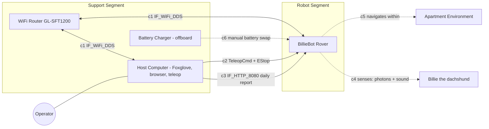

### 3.6 IBD-01 — Rover Data & Control (physical)

**Element specification** (owner block: `BillieBot Rover`; ports typed per §3.2):

| # | Connector (source → target) | Interface block | Item flow(s) | Notes |
|---|---|---|---|---|
| c1 | lidar.usb → jet.usb | `IF_USB_UART_115200` | `LaserScan` raw stream | `/dev/ttyUSB1` |
| c2 | oakd.usb3 → jet.usb3 | `IF_USB3` | RGB frames + on-device YOLO detections + stereo depth | detection runs on RVC2, not Jetson GPU |
| c3 | thermal.i2c → pi.i2c | `IF_I2C` | `ThermalFrame` raw | bus 1, addr 0x33 |
| c4 | noir.csi → pi.csi0 | `IF_CSI` | `NoIRFrame` raw | |
| c5 | jet.serial ↔ mcu.serial | `IF_UART_Serial_57600` | down: `WheelCmdFrame` (30 Hz); up: `WheelTicksFrame`, `AdcCountFrame`, `OK` acks | the safety-critical link (ACT-05, ACT-06) |
| c6 | imu.i2c → mcu.i2c | `IF_I2C` «futureRelease» | quaternion + gyro | blocked: A4/A5 pins used by right encoder **[GAP-2]** |
| c7 | encL/encR → mcu.pcint | `IF_Quadrature` | tick counts | pin-change ISRs |
| c8 | mcu.pwm → hbridge.in | `IF_PWM_DIR` | PWM 0–255 + direction | |
| c9 | hbridge.out → mtrL/mtrR | `IF_Power_12V` | `ElectricalPower` drive | L298N, ~2 V drop |
| c10 | micarr.usb → pi.usb | `IF_USB_Audio` | beamformed audio + DoA (ctrl transfer) | via powered hub |
| c11 | pi.i2s → amp.i2s | `IF_I2S` | PCM audio | MAX98357A |
| c12 | amp.out → spk | analog | audio power | 3 W speaker |
| c13 | jet.wlan ↔ rtr | `IF_WiFi_DDS` | all inter-host DDS flows of IBD-03 | static peer .100 |
| c14 | pi.wlan ↔ rtr | `IF_WiFi_DDS` | 〃 | static peer .101 |
| c15 | rtr ↔ host.wlan | `IF_WiFi_DDS` | operator flows | |
| c16 | pwr.bus → mcu.A0 | `IF_ADC_Divider` | battery voltage sense | 1/6 divider |

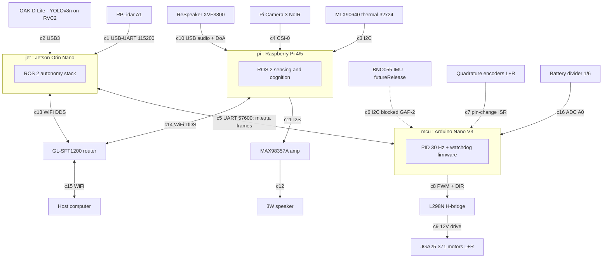

### 3.7 IBD-02 — Power Distribution

Connectors carry `ItemFlow : ElectricalPower`; verify by **Inspection** (SYS-PLT-3) plus the endurance soak (SYS-PLT-1). Modeled from design §4.2 — no power wiring exists in software to contradict it.

| # | Part / connector | Element | Notes |
|---|---|---|---|
| p1 | `bat : Venom 3S LiPo 11.1 V 4 Ah 20C` | source | 44 Wh |
| p2 | `fMain : Fuse 20 A` → p3 `sw : Master switch` → p4 `bus : Distribution bus` | series protection | star topology, common ground at bus only |
| p5 | bus → `fMot : Fuse 10 A` → hbridge VMOT → motors | motor branch | peak ≈ 40 W stall; separated from compute (SYS-PLT-3) |
| p6 | bus → `fCmp : Fuse 10 A` → jet barrel jack | compute branch | 9–19 V input, 3S direct; ≥ 1000 µF bulk cap at feed |
| p7 | bus → fCmp → `regPi : GeeekPi PD 5 V/5 A` → pi USB-C | compute branch | |
| p8 | bus → `fAux : Fuse 5 A` → `reg5A : GS2678 buck 5 V` → mcu, amp, IR LED, fan | accessory rail | IR illuminator lands here when purchased (SYS-PER-5) |
| p9 | bus → (reserved, fused) → `reg9A : Pololu D24V90F5 5 V/9 A` → future actuator rail | **reserved** | satisfies SYS-EXT-5 / EXT-05 |
| p10 | bus → `vsense : 1/6 divider` → mcu A0 | telemetry tap | closes the loop to MOB-12 / PLT-03 |

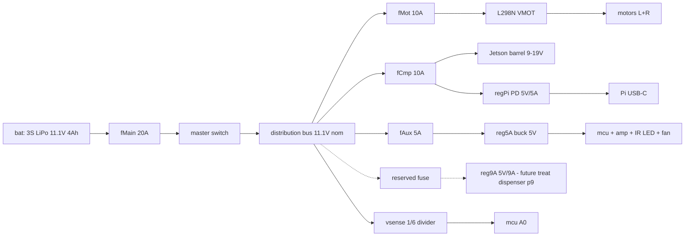

### 3.8 IBD-03 — Software Deployment / ROS Graph

The authoritative as-intended ROS graph. Parts are `«rosNode»` blocks allocated to `jet`/`pi` execution environments; connectors are stereotyped `«rosTopic»` / `«rosService»` / `«rosAction»`. **Bold gap tags** mark where the implementation deviates.

**Connector table (topics):**

| # | Topic «rosTopic» | Type (item flow) | Publisher → Subscriber(s) | Rate | Notes |
|---|---|---|---|---|---|
| c1 | `/cmd_vel` | `geometry_msgs/Twist` | controller_server, teleop, retreat_server → **base_bridge** | 20 Hz (nav) | single motion sink |
| c2 | `/odom` | `nav_msgs/Odometry` | **base_bridge** → ekf_filter_node, bt_navigator | 30 Hz | bt_navigator should move to c6 **[GAP-4]** |
| c3 | `/joint_states` | `sensor_msgs/JointState` | **base_bridge** → robot_state_publisher | 30 Hz | wheel TF |
| c4 | `/battery_state` | `sensor_msgs/BatteryState` | **base_bridge** → **mission_controller** | 1 Hz | SAFE-mode input |
| c5 | `/scan` | `sensor_msgs/LaserScan` | rplidar_node → slam_toolbox ∥ amcl, both costmaps | ~5.5–8 Hz | no mock source **[GAP-16]** |
| c6 | `/odometry/filtered` | `nav_msgs/Odometry` | ekf_filter_node → *(intended: Nav2)* | 30 Hz | currently unconsumed **[GAP-4]**; EKF launched twice **[GAP-6]** |
| c7 | `/dog/detections_3d` | `DogDetection3D` | **oakd_dog_detector** → **dog_locator**, **state_fusion** | 5 Hz | |
| c8 | `/dog/pose_map` | `geometry_msgs/PoseStamped` | **dog_locator** → **state_fusion**, **approach_dog_server** | ≤ 5 Hz | map-frame dog pose |
| c9 | `/thermal/image` | `sensor_msgs/Image` 32FC1 | **thermal_node** → (viewer) | 4 Hz | |
| c10 | `/thermal/blob` | `ThermalBlob` | **thermal_node** → **state_fusion** | ≤ 4 Hz | |
| c11 | `/noir/image` | `sensor_msgs/Image` rgb8 | **noir_cam_node** → *(no consumer)* | 5 Hz | night path open **[PER-06]** |
| c12 | `/audio/events` | `AudioEvent` | **audio_classifier** → **state_fusion**, **mission_controller** | ≤ 2 Hz | carries DoA |
| c14 | `/billie/state` | `DogState` | **state_fusion** → **dog_logger**, **mission_controller** | 2 Hz | the Behavior-AI contract topic |
| c16 | `/billiebot/mission_status` | `MissionStatus` | **mission_controller** → operator | 2 Hz | |
| c19 | `/dog/found` | `std_msgs/Bool` | **oakd_dog_detector** ∥ **dog_locator** → **mission_controller** | 5 Hz | dual publisher **[GAP-12]** |
| c20 | `/map` | `nav_msgs/OccupancyGrid` | slam_toolbox *(mapping)* ∥ map_server *(localization)* → costmaps, host | 0.2 Hz / latched | alternatives, never simultaneous |
| c21 | `/tf`, `/tf_static` | `tf2_msgs/TFMessage` | see IBD-04 | 30–50 Hz | odom→base_link dual broadcast **[GAP-5]** |
| c22 | `/robot_description` | `std_msgs/String` | robot_state_publisher → tools | latched | TC-02 |
| c23 | `/amcl_pose`, `/particle_cloud`, `/initialpose` | nav2 types | amcl ↔ operator | on update | relocalization surface |
| c24 | `/plan`, `/local_costmap/costmap`, `/global_costmap/costmap` | `Path`, `OccupancyGrid` | Nav2 servers → host | 1–2 Hz | visualization/verification |

**Connector table (services «rosService» / actions «rosAction»):**

| # | Name | Type | Server | Clients | Notes |
|---|---|---|---|---|---|
| c18 | `/e_stop` | `srv/EStop` | **base_bridge** | operator, *(intended: mission_controller)* | mission never learns of e-stop **[GAP-8]** |
| c17 | `/set_mode` | `srv/SetMode` | **mission_controller** | operator | |
| c15 | `/get_dog_state` | `srv/GetDogState` | **state_fusion** | operator, future policy | |
| c25 | `navigate_to_pose` | `nav2_msgs/action/NavigateToPose` | bt_navigator | **approach_dog_server**; *(intended: mission_controller)* | mission client idle **[GAP-7]** |
| c26 | `navigate_through_poses` | nav2 action | bt_navigator | *(intended: patrol executor)* | unused **[GAP-10]** |
| c27 | `/approach_dog` | `action/ApproachDog` | **approach_dog_server** | mission / future policy | rails: ≥ 1.0 m, ≤ 0.15 m/s |
| c28 | `/retreat` | `action/Retreat` | **retreat_server** | 〃 | open-loop |
| c13 | `/speak` and `/mission/speak` | `action/Speak` | **speaker_node** / **speak_server** wrapper | 〃 | naming split **[GAP-17]** |
| c29 | `/dispense_treat` | `action/DispenseTreat` | **dispense_treat_server** | «futureRelease» | NOT_IMPLEMENTED stub |
| c30 | `spin`, `backup`, `wait` | nav2 actions | behavior_server | bt_navigator recoveries | ACT-04 |

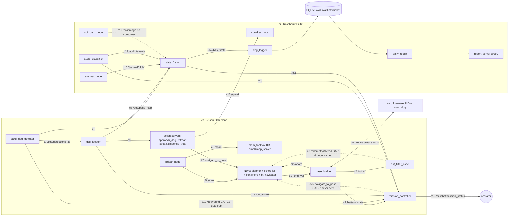

### 3.9 IBD-04 — TF Frame Tree (new)

REP-105 chain plus the URDF sensor frames — required to verify PER-07, NAV-05/07/15, and every map-frame requirement. Broadcast ownership is the load-bearing column:

| Transform | Broadcaster | Rate | Status |
|---|---|---|---|
| `map → odom` | amcl (localization) ∥ slam_toolbox (mapping) | on update / 50 Hz | ✅ correct single owner per session type |
| `odom → base_link` | **base_bridge AND ekf_filter_node (×2 instances)** | 30 Hz each | ❌ **[GAP-5, GAP-6]** — three contending broadcasters when rung 06 runs; NAV-07 |
| `base_link → chassis`, `chassis → laser_frame / oakd_link → oakd_link_optical / noir_link → noir_link_optical / thermal_link → thermal_link_optical / mic_link / imu_link(off)` | robot_state_publisher (`/tf_static`) | latched | ✅ positions are `TODO(measure)` placeholders (MEASURE_ME) |
| `base_link → left/right_wheel` | robot_state_publisher from `/joint_states` | 30 Hz | ✅ |

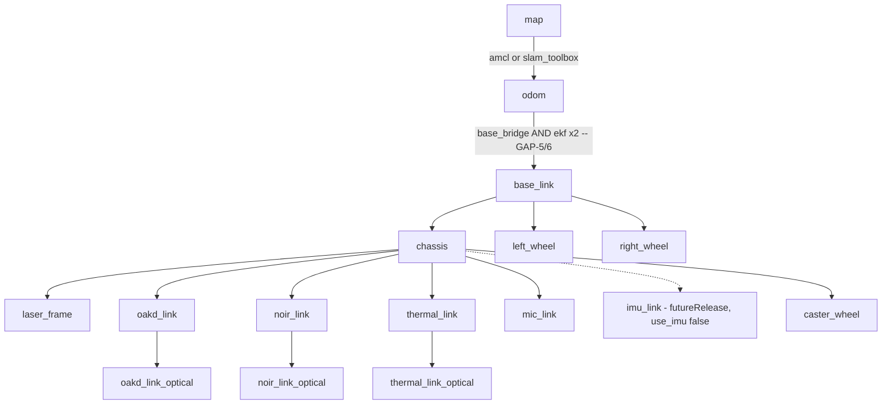

---

## 4. Behavioral Model — State Machine & Activity Diagrams

Activity partitions (swimlanes) are **allocated to the subsystem blocks of §3.1** so Cameo's allocation matrix auto-populates. Accept-event actions consume the Signals of §3.3. Elements marked **[GAP-n]** exist in the to-be model but are dormant or absent in code (register §5.4).

### 4.1 STM-01 — Mission Modes (state machine on the Rover block)

**Transition specification:**

| # | Transition | Trigger / guard | Live in code? |
|---|---|---|---|
| t1 | IDLE → PATROL | operator `/set_mode` or patrol schedule start | 🟡 service only; no scheduler |
| t2 | PATROL → INVESTIGATE | `SigAudioEvent` [event ∈ {BARK, HOWL, WHINE} ∧ has DoA] | ❌ **[GAP-15]** log-only |
| t3 | PATROL → TRACK_OBSERVE | `SigDogFound` [found = true] | ✅ |
| t4 | TRACK_OBSERVE → PATROL | dog lost (found = false persists) | ✅ |
| t5 | any → SAFE | battery voltage < 10.5 V | ✅ |
| t6 | any → SAFE | `SigEStop` [engage = true] | ❌ **[GAP-8]** `_estopped` never set |
| t7 | any → SAFE | recovery failures ≥ 3 | ❌ **[GAP-7]** counter never incremented |
| t8 | PATROL / TRACK_OBSERVE → RETURN | schedule end | ❌ no scheduler |
| t9 | RETURN → IDLE | arrived at dock/home pose | ❌ |
| t10 | INVESTIGATE → TRACK_OBSERVE | `SigDogFound` | ❌ (state unreachable) |
| t11 | INVESTIGATE → PATROL | investigation timeout, dog not found | ❌ |
| t12 | TRACK_OBSERVE → ENGAGE | [policy ≠ ObserveOnly] — «futureRelease» | by design absent (Behavior-AI insertion point) |
| t13 | SAFE → IDLE | operator reset via `/set_mode` | ✅ |

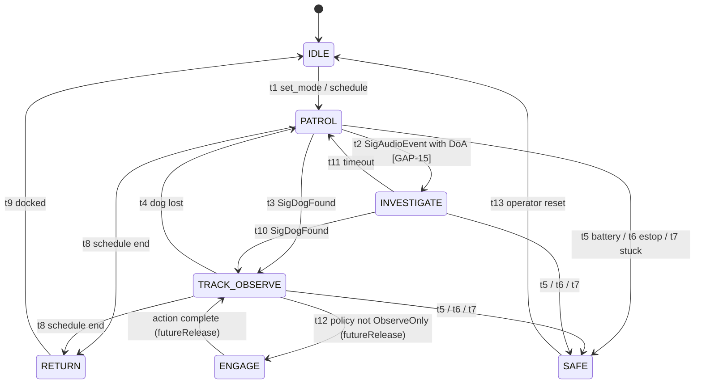

### 4.2 ACT-01 — Patrol & Find Billie

**Verifies:** SYS-NAV-6, SYS-FND-1/2, NAV-09/10, PER-01, MSN-04/05/06/12. **Partitions:** Mission (mission_controller) | Navigation (Nav2) | Perception (oakd_dog_detector, dog_locator) | Audio (audio_classifier).

| ID | Kind | Specification | Partition |
|---|---|---|---|
| a1 | call action | `LoadMapAndLocalize` (invokes ACT-08 localization branch) | Navigation |
| d1 | decision | [localized?] — else re-run a1 | Navigation |
| a2 | action | `LoadPatrolWaypoints` from `patrol_waypoints.yaml` **[GAP-10]** | Mission |
| a3 | action | `SeedPriorityQueue` — last-known dog location first, likelihood-weighted | Mission |
| a4 | action | `SelectNextWaypoint(priorityQueue)` | Mission |
| ae1 | accept-event | `SigAudioEvent(DoA)` — interrupts ir1 | Mission |
| a5 | action | `ReprioritizeQueueTowardDoA` **[GAP-15]** → re-enter a4 | Mission |
| a6 | call action | `Nav2.NavigateToPose(wp)` — result = `SigNavResult` **[GAP-7: never invoked]**; on ABORTED → ACT-04 | Navigation |
| a7 | fork (streams) | `ScanRGB(YOLO dog)` ∥ `ScanThermal` — continuous object flows into ACT-02 fusion | Perception |
| ae2 | accept-event | `SigDogFound` — interrupts ir1 | Mission |
| d2 | decision | [dog detected?] → a8; [queue exhausted?] → a9 ; else loop a4 | Mission |
| a8 | call behavior | `PolicyDecision` (MVP constant OBSERVE) → transition to TRACK_OBSERVE, invoke ACT-07 for standoff **[GAP-1]** | Mission |
| a9 | action | `MarkNotFound` → wait/retry timer → a3 | Mission |
| ir1 | interruptible region | encloses a4–a7; interrupted by ae1, ae2, and ACT-05's safety signals | — |

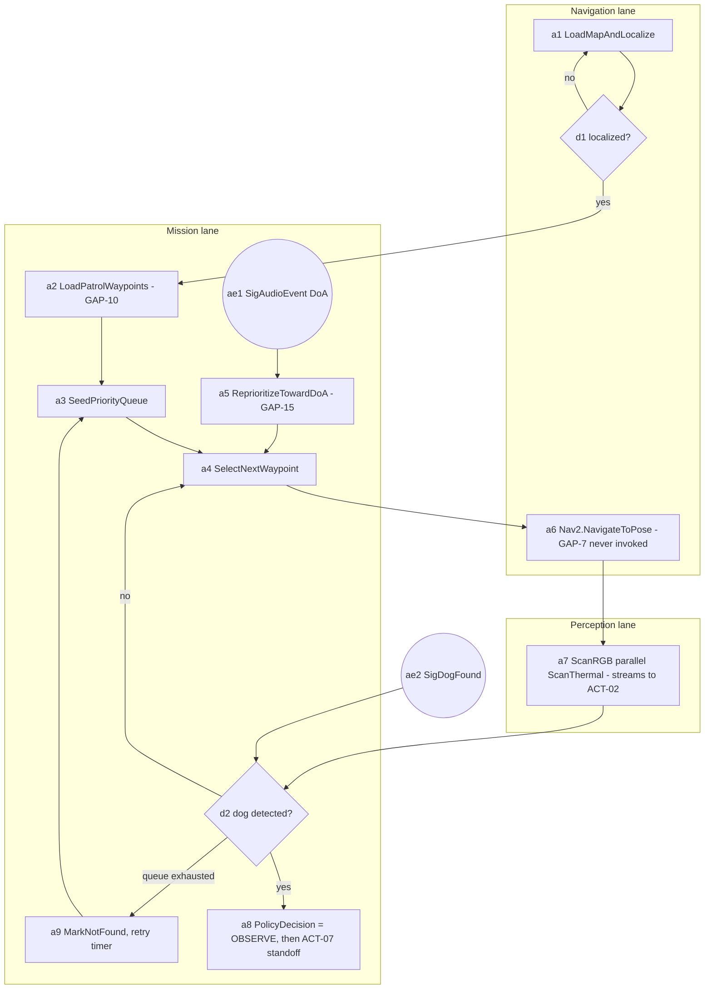

### 4.3 ACT-02 — Observe, Classify & Log

**Verifies:** SYS-STL-1/2/3/4, SYS-EXT-3/4, PER-03/05, AUD-01, STL-01…13. **Partitions:** Perception | Audio | Cognition (state_fusion) | Logging (dog_logger).

| ID | Kind | Specification | Partition |
|---|---|---|---|
| a1 | object flow in | `RgbDetection3D` stream (c7) | Perception |
| a2 | action | `TransformToMap` — TF camera→map, 0.1 s timeout → `DogPoseMap` (c8) | Perception |
| a3 | object flow in | `ThermalBlobEvt` stream (c10) | Perception |
| a4 | object flow in | `AudioEvt` stream (c12) | Audio |
| a5 | action | `MaintainEvidenceWindows` — 10 s sliding deques, pruned @ 2 Hz | Cognition |
| d1 | decision | [≥ 2 barks in window] → BARKING | Cognition |
| d2 | decision | [visual ∧ thermal < 33 °C ∧ no audio] → SLEEPING | Cognition |
| d3 | decision | [visual ∧ thermal < 36 °C ∧ no audio] → RESTING; [visual] → ACTIVE | Cognition |
| d4 | decision | [thermal only] → RESTING; [no evidence] → NOT_FOUND | Cognition |
| a6 | action | `ApplyHysteresis` — candidate must persist ≥ 3 s before commit | Cognition |
| a7 | action | `ComputeContextAndStress` — context[6], stress_proxy = min(1, bark_rate/0.3) | Cognition |
| a11 | action | `PublishDogState` → c14 (consumed by mission; future consumer: Behavior Policy) | Cognition |
| a8 | action | on `SigStateChanged` ∨ 60 s heartbeat: `AttributeRoom(rooms.yaml)` + `WriteEvent(SQLite WAL)` | Logging |
| a9 | action | `SnapshotImage` + fsync, path into event record **[GAP-9: placeholder]** | Logging |
| a10 | action | `RecordContextActionOutcome` — action/outcome from engagement action results **[GAP-9: action fixed OBSERVE]** | Logging |

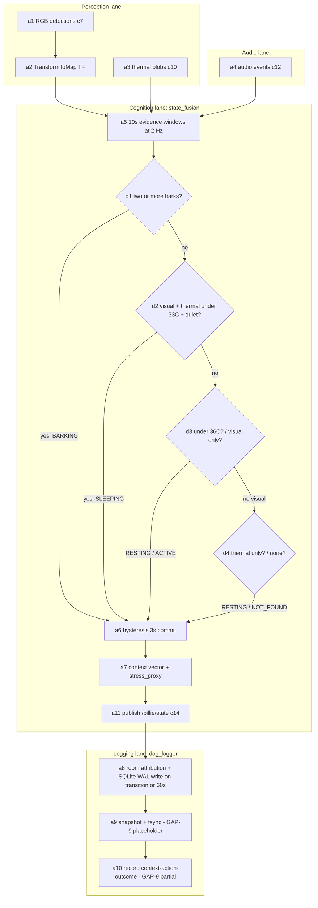

### 4.4 ACT-03 — Generate & Retrieve Daily Summary

**Verifies:** SYS-RPT-1/2, RPT-01…04. **Partitions:** Scheduler | Cognition (daily_report) | Support (report_server, host browser).

| ID | Kind | Specification | Partition |
|---|---|---|---|
| a1 | accept-event (time) | `SigDailyTimer` — 60 s tick matches 23:55 (`generate_hour/minute`); alt entry: CLI `--standalone <day>` (RPT-04) | Scheduler |
| a2 | action | `QueryEvents(day)` from SQLite | Cognition |
| a3 | action | `Aggregate` — per-state durations (5 min gap cap), bark log, room histogram | Cognition |
| a4 | action | `RenderReport` — Jinja2 Markdown; embed representative snapshots **[GAP-9]** | Cognition |
| a5 | action | `RenderTimelinePNG` — matplotlib Agg, per-state colors | Cognition |
| a6 | action | `PublishToWebServer` — write to `reports/` dir served by FastAPI | Support |
| a7 | action | operator retrieval: `GET /` (HTML), `/latest`, `/reports`, `/health` on :8080 | Support |

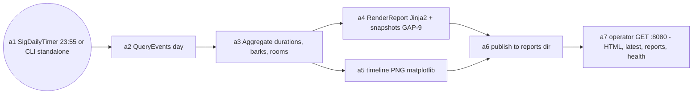

### 4.5 ACT-04 — Stuck Detection & Recovery

**Verifies:** SYS-NAV-4, NAV-13/14. **Partitions:** Navigation (Nav2 progress checker + behavior_server) | Mission (mission_controller).

| ID | Kind | Specification | Partition |
|---|---|---|---|
| a1 | action | `MonitorProgress` — progress checker: < 0.5 m in 10 s ⇒ stuck (L1 says > 5 s — align **[NAV-13]**) | Navigation |
| d1 | decision | [no progress?] | Navigation |
| a2 | action | `AbortCurrentPath` | Navigation |
| a3 | action | recovery `backup` (behavior_server) | Navigation |
| a4 | action | recovery `spin` (behavior_server) | Navigation |
| a5 | action | `Replan` (planner_server) | Navigation |
| d2 | decision | [recovered?] → resume ACT-01 a6 | Navigation |
| a6 | action | on `SigNavResult` = ABORTED: `IncrementFailureCount` **[GAP-7: never happens]** | Mission |
| d3 | decision | [failures ≥ 3?] | Mission |
| a7 | action | `EnterSAFE` (STM-01 t7) | Mission |
| a8 | action | `AlertOperator` **[GAP: no alert channel exists]** | Mission |

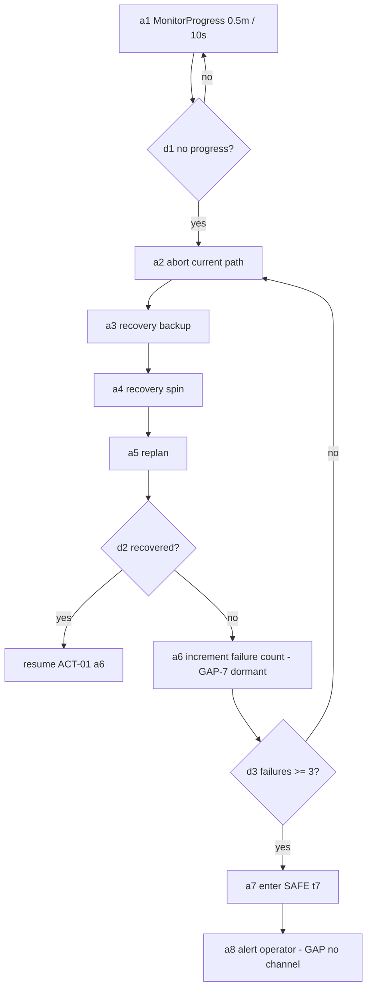

### 4.6 ACT-05 — Safety Chain: E-Stop, Deadman, Watchdog, Battery (new)

**Verifies:** SYS-PLT-2/5, MOB-04/05/06/07/12, MSN-02, PLT-03/04. Four independent protection layers — each must work with the others failed. **Partitions:** Operator | Base (base_bridge) | Firmware (mcu) | Mission.

| ID | Kind | Specification | Partition |
|---|---|---|---|
| ae2 | accept-event | `SigEStop` — `/e_stop {engage: true}` | Operator → Base |
| a1 | action | `EngageEStop` — set estop flag | Base |
| a2 | action | `ZeroTargetsAndSend m 0 0` — ≤ 200 ms budget (MOB-07: 33 ms loop + serial, met by analysis) | Base |
| a3 | action | `InhibitCmdVel` until `{engage: false}` | Base |
| a4 | action | `DeadmanCheck` — each 30 Hz tick: no `/cmd_vel` in 0.5 s ⇒ | Base |
| a5 | action | `CommandZero m 0 0` | Base |
| a6 | action | `WatchdogMonitor` — firmware: millis() − lastMotorCommand | Firmware |
| a7 | action | `AutoStop setMotorSpeeds(0,0)` at 500 ms (`AUTO_STOP_INTERVAL`) **[GAP-14: reference source still 2000 ms]** | Firmware |
| a8 | action | `SampleBattery` — serial `a`, ADC×5/1023×6.0, 1 Hz → `/battery_state` | Base |
| d2 | decision | [V ≤ 10.5 → LOW] [V ≤ 9.9 → CRITICAL] | Base |
| ae1 | accept-event | `SigBatteryLow` at mission tick (2 Hz) | Mission |
| a9 | action | `SafetyPrecheck` — estop ∨ battery ∨ failures ≥ 3 **[GAP-8: estop input never wired]** | Mission |
| a10 | action | `EnterSAFE + AlertOperator + RequestPickup` **[GAP: alert/pickup unimplemented]** | Mission |

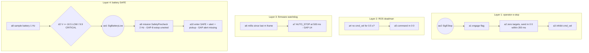

### 4.7 ACT-06 — Drive Control Loop (new)

**Verifies:** MOB-01/02/03/08/09/11, NAV-06/11. The 30 Hz closed loop that every navigation requirement rides on. **Partitions:** Navigation (Nav2 controller) | Base (base_bridge) | Firmware (mcu) | State Estimation (EKF).

| ID | Kind | Specification | Partition |
|---|---|---|---|
| a1 | action | init: `ResetEncoders` (serial `r`) when `reset_encoders_on_start` | Base |
| a2 | object flow in | `/cmd_vel` (`BodyVelCmd`, ≤ 0.3 m/s per NAV-11) | Navigation |
| a3 | action | `InverseKinematics` — v ± ω·d/2, r = 0.034 m, d = 0.298 m → wheel rad/s | Base |
| a4 | action | `SendWheelCmd` — counts/loop = rad/s ÷ 2π × 2000 ÷ 30; serial `m L R` @ 30 Hz | Base |
| a5 | action | `ParseAndSetTarget` — TargetTicksPerFrame per wheel; reset auto-stop timer | Firmware |
| a6 | action | `PIDUpdate` @ 30 Hz (Kp 20, Kd 12, Ki 0, Ko 50; anti-windup) | Firmware |
| a7 | action | `PWMOut` → L298N → motors | Firmware |
| a8 | action | `ReadEncoders` — serial `e` → cumulative ticks | Base |
| a9 | action | `IntegrateOdometry` — midpoint-arc model | Base |
| a10 | action | `Publish` — `/odom`, `/joint_states`, TF odom→base_link @ 30 Hz | Base |
| a11 | action | `EKFFuse` → `/odometry/filtered` (+ IMU when enabled **[GAP-2]**) | State Estimation |

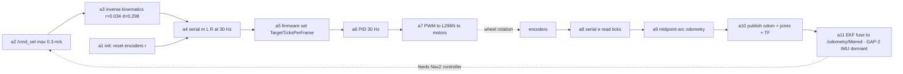

### 4.8 ACT-07 — Approach & Standoff (new)

**Verifies:** SYS-FND-3, SYS-NAV-5 (near-dog half), MSN-09/10/13, AUD-05, NAV-12. **Partitions:** Mission/Policy (client) | Engagement (approach_dog_server) | Navigation (Nav2).

| ID | Kind | Specification | Partition |
|---|---|---|---|
| a1 | accept goal | `ApproachDog{standoff_distance, max_speed}` | Engagement |
| d1 | decision | [standoff < 1.0 m?] → **reject** (welfare floor, enforced below policy — MSN-13) | Engagement |
| a2 | action | `ReadDogPose` from `/dog/pose_map` (c8) | Engagement |
| a3 | action | `ComputeStandoffPose` — (dog_x − standoff, dog_y) | Engagement |
| a4 | action | `CapSpeed ≤ 0.15 m/s` (`max_speed` param) | Engagement |
| a5 | call action | `Nav2.NavigateToPose(standoff pose)` (c25) | Navigation |
| a6 | constraint | near-dog speed-filter mask ≤ 0.15 m/s within 2 m **[GAP-13: not implemented — only this server's own goals are capped]** | Navigation |
| a7 | action | `FeedbackAndResult` — current_distance/speed feedback; result final_distance + position | Engagement |
| alt | alt-flow | `Retreat{retreat_distance}` — reverse `/cmd_vel` at 0.1 m/s, **open-loop timed** (MSN-10 🟡) | Engagement |

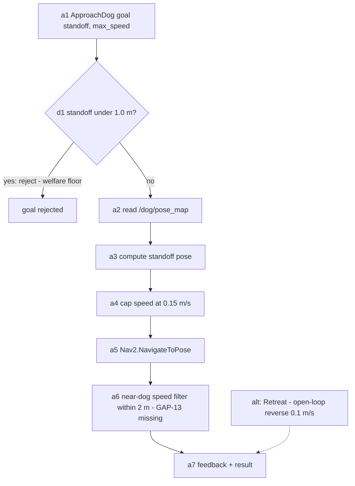

### 4.9 ACT-08 — Startup, Localization & Multi-Machine Bringup (new)

**Verifies:** PLT-01/02/06, NAV-01/02/03/05, the bringup-ladder testability requirements. **Partitions:** Jetson | Pi | Operator.

| ID | Kind | Specification | Partition |
|---|---|---|---|
| a1 | action | `SetDDSConfig` — `CYCLONEDDS_URI` → cyclonedds.xml (multicast off, peers .100/.101); launch `jetson.launch.py` / `pi.launch.py` | both |
| a2 | action | `StartDrivers` — rplidar (`/scan`), base_bridge (serial connect, `r` reset) — mock branch **[GAP-16: no mock /scan]** | Jetson |
| a3 | action | `StartDescription` — robot_state_publisher: `/robot_description`, `/tf_static` sensor frames | Jetson |
| a4 | action | `StartEKF` (single instance required — **[GAP-6]** rung 06 starts two) | Jetson |
| d1 | decision | [mapping session?] → a5; [localization session?] → a7 | Operator |
| a5 | action | `SLAMMapping` — slam_toolbox builds `/map` while operator teleops apartment | Jetson |
| a6 | action | `SaveMap` — YAML+PGM artifact (input to a7 and to rooms/waypoint configs) | Operator |
| a7 | action | `LoadMap` — map_server (lifecycle: configure fails on empty `map` arg) | Jetson |
| a8 | action | `AMCLInit` — initial pose (0,0,0), particle filter 500–2000 | Jetson |
| a9 | action | `LifecycleActivate + Converge` — drive until particle cloud shrinks; `map→odom` stable | Jetson |
| a10 | action | `StartPerceptionCognitionMission` — Pi rungs 09–12, Jetson 07/08/13 | both |

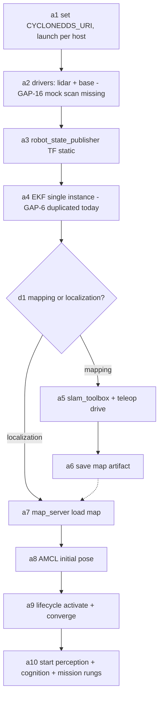

---

## 5. Traceability, Allocation & Compliance (package `6 Analysis`)

### 5.1 Satisfy matrix — L1 requirement → satisfying blocks → L2 children

| L1 | Satisfied by (blocks) | L2 children (§2.3) |
|---|---|---|
| SYS-NAV-1 | rplidar_node, slam_toolbox, map_server | NAV-01, NAV-02, NAV-03, NAV-15 |
| SYS-NAV-2 | base_bridge, ekf_filter_node, amcl, robot_state_publisher | MOB-08, MOB-09, MOB-11, NAV-05, NAV-06, NAV-07, NAV-08, NAV-15 |
| SYS-NAV-3 | Nav2 servers, base_bridge, mcu firmware | MOB-01, MOB-02, MOB-03, MOB-10, NAV-09, NAV-10 |
| SYS-NAV-4 | Nav2 progress checker + behavior_server, mission_controller | NAV-13, NAV-14 |
| SYS-NAV-5 | controller_server (DWB), approach_dog_server, *(missing: speed-filter layer)* | NAV-11, NAV-12 |
| SYS-NAV-6 | *(intended: patrol executor + bt_navigator)* | MSN-05, MSN-06, MSN-14 |
| SYS-FND-1 | mission_controller | MSN-05 (queue seeding in ACT-01 a3) |
| SYS-FND-2 | mission_controller, audio_classifier | MSN-04, AUD-02/03 |
| SYS-FND-3 | approach_dog_server, dog_locator | MSN-09, PER-03 |
| SYS-FND-4 | whole find chain | acceptance-level: ACT-01 end-to-end (TC below) |
| SYS-PER-1 | oakd_dog_detector | PER-01, PER-02, PER-08 |
| SYS-PER-2 | oakd_dog_detector, dog_locator, robot_state_publisher | PER-02, PER-03, PER-04, PER-07 |
| SYS-PER-3 | thermal_node | PER-05 |
| SYS-PER-4 | audio_classifier, micarr | AUD-01, AUD-02, AUD-03, AUD-04 |
| SYS-PER-5 | noir_cam_node (+ IR illuminator, HW gap) | PER-06 |
| SYS-STL-1 | state_fusion | STL-01…05, STL-08 |
| SYS-STL-2 | dog_logger | STL-09, STL-11, STL-12, STL-14 |
| SYS-STL-3 | state_fusion (DogState schema) | STL-05, STL-07, IFC-02 |
| SYS-STL-4 | dog_logger (SQLite WAL) | STL-09, STL-10 |
| SYS-RPT-1 | daily_report | RPT-01, RPT-02, RPT-04 |
| SYS-RPT-2 | report_server | RPT-03 |
| SYS-PLT-1 | pwr subsystem (design §4.2) | PLT-07 |
| SYS-PLT-2 | base_bridge, mission_controller, vsense | MOB-12, PLT-03, PLT-04 |
| SYS-PLT-3 | pwr subsystem (IBD-02) | PLT-08 |
| SYS-PLT-4 | base_bridge, mission_controller, report_server, DDS config | PLT-05, MSN-07, MSN-08, MOB-13, PLT-06, PLT-09, IFC-07 |
| SYS-PLT-5 | base_bridge, mcu firmware | MOB-04, MOB-05, MOB-06, MOB-07 |
| SYS-PLT-6 | speaker_node | AUD-05 |
| SYS-EXT-1…5 | action servers, policy node, dog_logger, state_fusion, pwr | EXT-01…05, MSN-11/12/13, STL-06/07/13, IFC-08 |

**Model check (per design Appendix A step 6):** every SYS-* has ≥ 1 satisfying block and ≥ 1 L2 child; every L2 has ≥ 1 verifying diagram element and (where testable today) a TC. Verified by construction above. SYS-FND-4 and SYS-PLT-1 are acceptance-level (system-of-blocks) and verify against ACT-01 / the endurance soak rather than a single block.

### 5.2 Verify matrix — acceptance tests → requirements → diagrams

Existing TC-01…TC-22 (docs/VERIFICATION.md), plus **eight proposed tests (TC-23…TC-30)** covering requirements this report exposed as untested:

| TC | Verifies | Demonstrated on |
|---|---|---|
| TC-01 interfaces build | IFC-01…08 | — |
| TC-02 URDF validity | NAV-15 | IBD-04 |
| TC-03 odometry | MOB-08, MOB-09 | ACT-06 |
| TC-04 joint states | MOB-09 | ACT-06 |
| TC-05 battery monitoring | MOB-12, PLT-03 | ACT-05 L4 |
| TC-06 e-stop service | MOB-04, MOB-06, MOB-07 | ACT-05 L1/L2 |
| TC-07 dog 3D detection | PER-01, PER-02 | ACT-01 a7 |
| TC-08 dog locator TF | PER-03 | ACT-02 a2 |
| TC-09/10 thermal image + blob | PER-05 | ACT-02 a3 |
| TC-11 audio classification | AUD-01…04 | ACT-02 a4 |
| TC-12 state fusion | STL-01…06 | ACT-02 |
| TC-13 mission status | MSN-01, MSN-03, MSN-07 | STM-01 |
| TC-14 GetDogState | STL-08 | IBD-03 c15 |
| TC-15 SetMode | MSN-08 | IBD-03 c17 |
| TC-16 waypoint navigation | NAV-09, NAV-10, MSN-05, MSN-06 | ACT-01 |
| TC-17 standoff distance | MSN-09 | ACT-07 |
| TC-18 speed limiting | NAV-11, NAV-12 | ACT-06/07 |
| TC-19 stuck recovery | NAV-13, NAV-14 | ACT-04 |
| TC-20 SQLite logging | STL-09, STL-10, EXT-03 | ACT-02 a8–a10 |
| TC-21 daily report | RPT-01, RPT-02, RPT-04 | ACT-03 |
| TC-22 report server | RPT-03 | ACT-03 a6–a7 |
| **TC-23** ★ mock `/scan` publisher; rung 01 verify passes in mock | NAV-04, PLT-06 | ACT-08 a2 |
| **TC-24** ★ exactly one `odom→base_link` broadcaster under full bringup | NAV-07 | IBD-04 |
| **TC-25** ★ AMCL relocalization ≤ 0.15 m at ≥ 3 surveyed points (design's TC-NAV-2) | NAV-05 | ACT-08 a9 |
| **TC-26** ★ battery-SAFE reaction end-to-end (needs injectable mock battery voltage) | PLT-04, MSN-02 | ACT-05 L4 |
| **TC-27** ★ audio-DoA INVESTIGATE entry + queue re-sort | MSN-04 | ACT-01 ae1/a5, STM-01 t2 |
| **TC-28** ★ snapshot files non-empty and referenced by events | STL-12, RPT-02 | ACT-02 a9 |
| **TC-29** ★ heartbeat watchdog timing rig: motors stop ≤ 500 ms; e-stop PWM cut ≤ 200 ms | MOB-05, MOB-07 | ACT-05 L1/L3 |
| **TC-30** ★ 60 min endurance soak on patrol duty cycle | PLT-07 | — |

### 5.3 Allocation matrix — «rosNode» → execution environment

| Node | jet | pi | mcu |
|---|:-:|:-:|:-:|
| base_bridge, rplidar_node, robot_state_publisher, ekf_filter_node, slam_toolbox / (map_server + amcl), controller/planner/behavior servers, bt_navigator, lifecycle managers, oakd_dog_detector, dog_locator, mission_controller, approach/retreat/speak/dispense servers | ● | | |
| thermal_node, noir_cam_node, audio_classifier, speaker_node, state_fusion, dog_logger, daily_report, report_server | | ● | |
| ROSArduinoBridge firmware (PID, encoders, ADC, watchdog) | | | ● |

Launch evidence: `jetson.launch.py` (rungs 06 + 07 + 08 + 13), `pi.launch.py` (rungs 09–12), per PLT-01.

### 5.4 Compliance summary & discrepancy register

**L2 status rollup (97 requirements):** ✅ Satisfied 57 · 🟡 Partial 19 · ❌ Gap 13 · ⬜ HW-pending 8.

Canonical gap register. GAP-1…10, 14, 16, 17 correspond to the design-vs-code discrepancy analysis; GAP-11, 12, 13, 15, 18, 19 are renumbered or added by this report. **Disposition: F = fix code · M = update model/design doc · P = parameter/config change · H = hardware task.**

| GAP | Description | Requirements hit | Disposition |
|---|---|---|---|
| GAP-1 | Mission logic is a Python state machine; BT XML + `PolicyDecision`/guard C++ nodes are compiled but never executed; most BT leaf nodes referenced in `billiebot_main.xml` are undefined | SYS-EXT-2, MSN-01, MSN-12, EXT-02 | F (either run the BT or port `PolicyDecision` into the controller) |
| GAP-2 | `/imu/data` never published; EKF `imu0` commented out; BNO055 blocked by A4/A5 encoder pin conflict | NAV-06 | H (rewire per MEASURE_ME) then P |
| GAP-3 | `BatteryStatus.msg` defined, published by nothing (`sensor_msgs/BatteryState` used instead) | IFC-06 | M (delete) or F (adopt) |
| GAP-4 | `bt_navigator.odom_topic` = raw `/odom`; `/odometry/filtered` unconsumed | NAV-08 | P |
| GAP-5 | `odom→base_link` broadcast by both base_bridge and EKF (`publish_tf: true` twice) | NAV-07 | P (disable in `base_driver.yaml` when EKF runs) |
| GAP-6 | Second `ekf_filter_node` launched by `navigation.launch.py` on top of rung 03's | NAV-07 | F (remove duplicate include) |
| GAP-7 | Mission never sends Nav2 goals; `_nav_failure_count` never incremented — patrol dispatch and SAFE escalation dormant | MSN-05, NAV-14, SYS-NAV-4/6, SYS-FND-1 | F (largest functional gap) |
| GAP-8 | `_estopped` never set — mission SAFE-on-estop branch and `MissionStatus.estopped` dead | MSN-02 | F (subscribe/estop-state service from base_bridge) |
| GAP-9 | dog_logger narrower than design: snapshots are empty placeholder files; `action`/`outcome` not captured from action results; no `/events/last` | STL-12, STL-13, STL-14, RPT-02, EXT-03 | F |
| GAP-10 | `PatrolWaypoints.action` has no server; `patrol_waypoints.yaml` loaded by nothing | MSN-06, MSN-14, SYS-NAV-6 | F |
| GAP-11 | `oakd_dog_detector` `model_path` default `''` ⇒ real mode logs error, creates no pipeline | PER-01 | P (require param; fail loudly) |
| GAP-12 | `/dog/found` published by both oakd_dog_detector and dog_locator | PER-04 | F (single owner: dog_locator) |
| GAP-13 | No near-dog speed restriction: no speed-filter/keepout costmap layer fed by `/dog/pose_map`; only ApproachDog's own goals are capped | NAV-12, SYS-NAV-5 | F |
| GAP-14 | Reference firmware still `AUTO_STOP_INTERVAL 2000`; the 500 ms value exists only in `firmware/README.md` | MOB-05, SYS-PLT-5 | F (apply + flash) |
| GAP-15 | Audio-DoA response is a log statement: no INVESTIGATE entry, no queue re-sort | MSN-04, SYS-FND-2 | F |
| GAP-16 | Rung 01 mock branch launches a base_bridge stub — no mock `/scan`; SLAM/AMCL/costmap rungs unexercisable in mock | NAV-04, PLT-06 | F (dedicated mock scan publisher) |
| GAP-17 | Speak action naming split: `/speak` (speaker_node) vs `/mission/speak` (wrapper); BT XML `Speak` id binds to neither | AUD-06 | F (canonical name) or M |
| GAP-18 | `/oak/rgb/preview` in design §5.2 but not published (operator visualization) | SYS-PLT-4 (minor) | M or F |
| GAP-19 | Host naming drift: design says Pi 5; configs/README say Pi 4 | documentation only | M |

---

## 6. New-Requirement Recommendations

### 6.1 Requirements added by this report (already in §2.3)

Fourteen L2 requirements have no direct parent sentence in the design document — they close silent assumptions the implementation exposed. In Cameo, trace them `deriveReqt` to the L1 shown, stereotyped «derivedByAnalysis»: **MOB-07** (200 ms e-stop budget as its own testable item), **NAV-04** (mock scan source), **NAV-07** (single TF owner), **NAV-08** (filtered-odom consumption), **NAV-15** (URDF/config consistency), **PER-04** (single `/dog/found` owner), **PER-07** (optical-frame stamping), **AUD-06** (canonical Speak name), **STL-14** (`/events/last`), **RPT-04** (on-demand report), **MSN-14** (PatrolWaypoints server), **IFC-06** (one battery contract), **IFC-09** (IBD-03 as topic-name source of truth), **PLT-06/PLT-09** (mock fidelity + per-rung verify scripts).

### 6.2 Proposed requirements for sponsor approval (not yet levied)

| ID | Proposed shall statement | Rationale | Trace |
|---|---|---|---|
| PROP-01 | The system shall provide an operator alert channel (e.g., report-server push/webhook or speaker chime) used by SAFE-mode entry and recovery-failure escalation. | SYS-NAV-4 and SYS-PLT-2 both demand "alert"; no mechanism exists anywhere in the architecture. | SYS-NAV-4, SYS-PLT-2 |
| PROP-02 | The system shall provide a patrol scheduler (start/end times) driving STM-01 t1/t8 (IDLE→PATROL, →RETURN). | Design ConOps implies scheduled patrols and 23:30 report; only the report has a timer. | STK-1, SYS-RPT-1 |
| PROP-03 | INVESTIGATE mode shall navigate toward the DoA bearing for a bounded time/distance, then hand off to TRACK_OBSERVE or back to PATROL. | Mode exists in every enum but no behavior is specified anywhere. | SYS-FND-2 |
| PROP-04 | Stuck-detection parameters shall be reconciled: either SYS-NAV-4 relaxes to the Nav2 progress-checker values (0.5 m / 10 s) or the checker is tightened to 5 s. | The L1 requirement and configuration disagree; a test against the L1 text would fail today. | SYS-NAV-4 / NAV-13 |
| PROP-05 | Room polygons in `rooms.yaml` shall be mutually exclusive after apartment mapping; the logger shall reject/flag overlapping definitions. | Current placeholder rectangles overlap; room attribution is order-dependent. | STL-11 |
| PROP-06 | Mock mode shall support fault injection (settable battery voltage, scan dropout, detection dropout) so SAFE-mode and recovery paths are testable without hardware. | Mock battery is a constant 12.58 V — TC-26 impossible as built. | PLT-06 |
| PROP-07 | An 850 nm IR illuminator shall be fitted on the 5 V accessory rail (switched by mcu GPIO + MOSFET) to close the NoIR night path — or SYS-PER-5 shall be waived for MVP in favor of thermal-only night operation. | Design hardware-gap list; decision needed, not just hardware. | SYS-PER-5 |
| PROP-08 | The Retreat primitive shall verify commanded distance against odometry (closed-loop) before being used near stairs/hazards. | Current implementation is open-loop timed. | MSN-10 |

---

## 7. Appendix — Cameo/MSOSA Modeling Checklist

Extends design Appendix A for this report's additions. Suggested order:

1. **Project + profile** — new SysML project; package tree per §1.3; stereotypes «futureRelease», «rosNode», «rosTopic», «rosService», «rosAction», «mockable», «derivedByAnalysis».
2. **Requirements import** — CSV/Excel-sync three tables: §2.1 (REQ-01), §2.2 (REQ-02), §2.3 (REQ-03). Columns map: ID→`id`, shall→`text`, V→custom `verifyMethod`, Status→custom `implStatus` enum, Evidence→custom `evidence`.
3. **deriveReqt** — L2→L1 from each row's Trace column; L1→L0 per §2.2 group headers.
4. **Blocks** — §3.1 dictionary into `3 Structure` (BDD-00/01 per design §3.2–3.3); «rosNode» blocks under a `Software` package with allocation dependencies to jet/pi/mcu (matrix §5.3 auto-populates).
5. **Interfaces** — §3.2 interface blocks, §3.3 signals, §3.4 item-flow classifiers into `5 Interfaces`; proxy ports on the hardware blocks typed accordingly.
6. **IBDs** — IBD-00 (§3.5), IBD-01 (§3.6), IBD-02 (§3.7), IBD-03 (§3.8 — transcribe both connector tables; every row is one connector with its item flow), IBD-04 (§3.9, as a nested part/frame view or a dedicated block hierarchy).
7. **Behavior** — STM-01 transitions t1–t13 (§4.1; t12 «futureRelease»); ACT-01…ACT-08 with partitions **allocated to subsystem blocks**, accept-event actions bound to §3.3 signals, and the ACT-01 interruptible region ir1.
8. **satisfy / verify** — §5.1 satisfy dependencies; §5.2 verify dependencies from test cases TC-01…TC-30 (model TC-23…30 as «testCase» stubs pending sponsor approval).
9. **Consistency gates** (per design Appendix A step 6): every SYS-* has ≥ 1 satisfy and ≥ 1 verify; every L2 traces to an L1; every ❌/🟡 requirement references a GAP-n in §5.4; every GAP-n has a disposition owner.

**Reading order for a new engineer:** §1 → IBD-03 (§3.8) → STM-01 (§4.1) → ACT-05 (§4.6, the safety spine) → §5.4 (what's real vs. aspirational).

*— End of report —*


